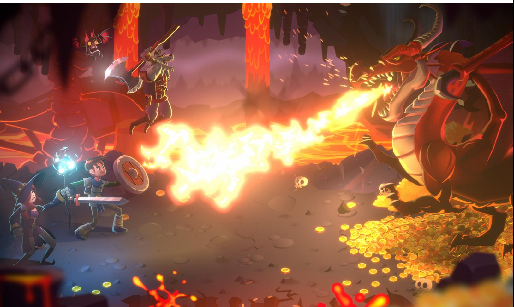
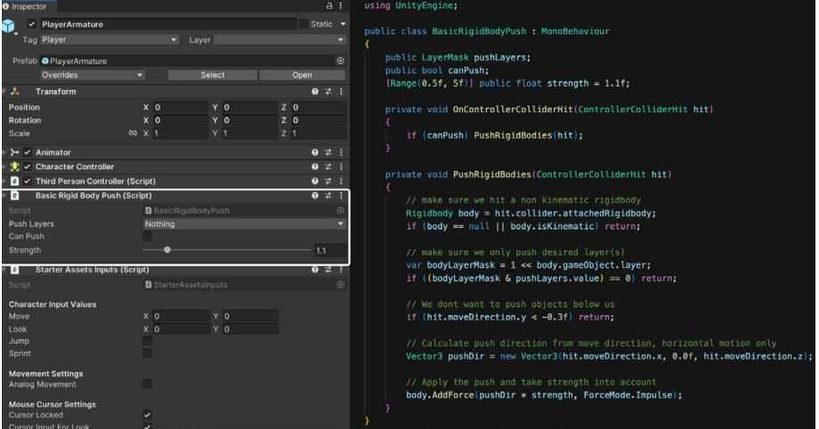
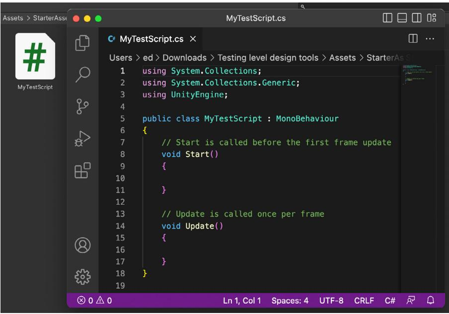
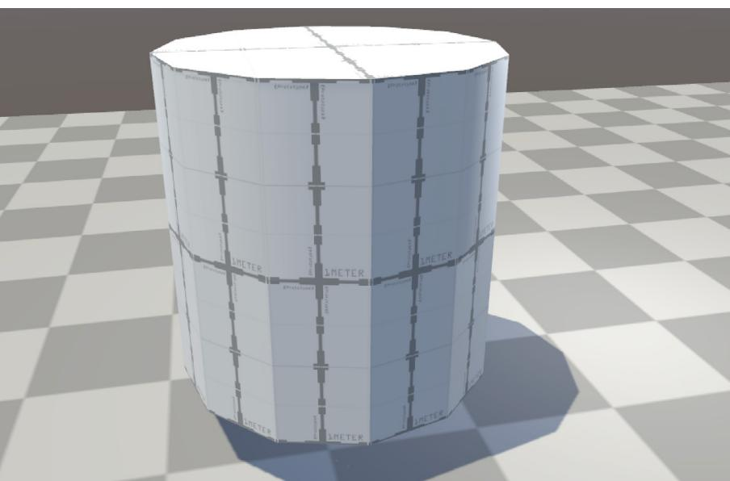

### I N T R O D U C T I O N T O GAME LEVEL DESIGN

UNITY 2022 LTS EDITION

**E-BOOK**

### **Contents**

| Introduction. 3                                             |
|-------------------------------------------------------------|
| Contributors. 4                                             |
| Part I: Introduction to level design in game development. 5 |
| Common terms used in level design. 5                        |
| Preproduction. 8                                            |
| Coherent design. 8                                          |
| Research and references guide 9                             |
| Know your audience. 10                                      |
| The 3Cs: Camera, character, and control 12                  |
| Camera. 12                                                  |
| Character. 12                                               |
| Control. . 13                                            |
| Metrics 14                                                  |
| Paper design. 16                                            |
| Identify and understand the different game mechanics. . 17  |
| Test the game mechanics in a gym/zoo. 18                    |
| Pacing and gameplay beats 19                                |
| A living world: Environmental storytelling 20               |
| Production. 21                                              |
| White-boxing: Blocking out your level. 21                   |
| Give descriptive names to blocky assets. 22                 |
| Add Materials to blocky assets to                           |
| visualize your intention. 23                                |
| Avoid creating detailed art assets 23                       |
| Ask a concept artist for help. 23                           |
| Ready-made assets can also help. 24                         |
| Player pathing. 25                                          |

| Critical path 25                                                         |
|--------------------------------------------------------------------------|
| Golden path 26                                                           |
| Secondary and tertiary paths: Side quests, secrets, and shortcuts. 26 |
| The rule of three for teaching mechanics to players 27                   |
| Subverting expectations. 28                                              |
| Line of sight and blind spots. 29                                        |
| Get the player's attention 29                                            |
| Lighting and space. 30                                                   |
| Physical blockers. 30                                                    |
| Signposting. 31                                                          |
| Sound. 32                                                                |
| Spawn points 32                                                          |
| Save points and checkpoints 32                                           |
| Save points. 33                                                          |
| Checkpoints. 33                                                          |
| Avoid soft-locking 33                                                    |
| Mindful placement of save points and checkpoints. 34                     |
| Procedural level design. 34                                              |
| Procedural generation rules 35                                           |
| Automated testing. 36                                                    |
| Test, test, and test again. 36                                           |
| Part II: Introduction to Unity for level designers. 37                   |
| Install Unity. 37                                                        |
| The Unity Editor. 39                                                     |
| Package Manager. 41                                                      |
| GameObjects 41                                                           |
| Manipulating GameObjects in the Scene view 42                            |
| Creating GameObjects. 44                                                 |

| Static and dynamic GameObjects. 44   |
|--------------------------------------|
| Active/inactive GameObjects. 45      |
| Tags. 45                             |
| Prefabs: Reusable GameObjects. 45 |
| 3D or 2D. 48                         |
| 3D assets 48                         |
| File formats. 49                     |
| 2D assets 49                         |
| File formats. 50                     |
| Coding. 51                           |
| Quick overview of C#. 51             |
| Creating a new script. 52            |
| A script example. 53                 |
| Learn resources. 54                  |
| Unity Visual Scripting. 54           |
| Creating a new Script Graph. 55      |
| Variables in Visual Scripting 56     |
| State Machines with State Graph. 58  |
| More resources 59                    |
| Physics 59                           |
| Creating collisions 60               |
| Collider component. 60               |
| Rigidbody component. 60              |
| Trigger colliders. 63                |
| Physics layers. 63                   |
| Level design with physics. 64        |
| Physics refresh rate. 65             |
| Animation 66                         |
| The animation system. 66             |
| Animation window. 67                 |
|                                      |

| Animation State Machine. 68                            |
|--------------------------------------------------------|
| Timeline. 69                                           |
| More resources. 69                                     |
| The Unity Asset Store. 70                              |
| Part III: Level design tools in Unity. 71              |
| Starter assets. 71                                     |
| ProBuilder. 74                                         |
| Smoothing groups. 88                                   |
| UV Editor. 90                                          |
| Quick texturing exercise. 91                           |
| Tip: Color coding for fast level design. 93            |
| Tip: Enable dimension overlays for ProBuilder. 93      |
| Sharing ProBuilder levels with environment artists. 94 |
| Polybrush 95                                           |
| Quick tip: visualizers 97                              |
| 3D object text. 97                                     |
| Custom icon for GameObjects 97                         |
| Splines. 98                                            |
| Terrain. 100                                           |
| 2D Tilemap. 102                                        |
| 2D Tilemap extras 104                                  |
| Pathfinding with AI Navigation. 105                    |
| The Navigation window: Agents and areas. 106           |
| Three steps to creating navigable                      |
| paths with AI Navigation. 107                          |
| Level design tools quick reference. 109                |
| Additional level design resources. 111                 |
| Professional training for Unity creators. 111          |

### INTRODUCTION

Creators of virtual worlds and wizards of spatial awareness: Level designers are the master builders in game development, tasked with the coherent layout and composition of fully realized playable spaces.

This three-part guide is intended for both aspiring and experienced level designers. It was written by level and game designers, both within Unity and from professional game development teams.

Unity is the most widely used game development platform, so gaining Unity skills can open up new opportunities for you, even if you work on a team using another engine.

#### **What's in this guide?**

**Part I** provides an introduction to where, and how, the work of level designers fits into the game development production cycle. Topics covered include researching and developing an idea, prototyping designs with white- or greyboxing, and working with the fundamental elements of level design, such as player paths, lighting, clues, and points gathering.

**Part II** is an introduction to the Unity Editor, the building blocks for adding elements and interactivity to a scene in Unity, and working with assets, scripting, physics and animation.

**Part III** provides detailed instructions on how to use the ProBuilder and Polybrush toolsets, an introduction to the Unity Terrain system, and recommendations for tools available from the Unity Asset Store.

*Monument Valley 2* by Ustwo Games is a puzzler that makes inventive use of 3D space.

This e-book complements *[The Unity game designer playbook](https://resources.unity.com/games/game-designer-playbook?ungated=true%3Futm_source&utm_medium=pdf&utm_campaign=expanded-worlds&utm_content=level-design-ebook)*, which provides a broader overview of Unity tools for game and level designers, as well as expert tips for designing gameplay.

#### Contributors

[Christo](https://twitter.com/CH71ST0) Nobbs is a senior technical game designer who specializes in systems game design and Unity (C#). Christo has been using Unity since Unity 4 and worked previously as a technical game designer at PUBG/PlayerUnknown Productions.

Stefan [Horvath](https://www.linkedin.com/in/stefan-horvath94/) has over 10 years of experience in the game development industry with experience in level and game design, as well as quality assurance. He's worked on titles such as *Star Citizen* by Cloud Imperium Games, *Dead by Daylight* by Behaviour Interactive, and 505 Games, and *Tribes of Midgard* by Norsfell Games Inc.

[Eduardo](https://twitter.com/EduOriz) Oriz is a senior content marketing manager at Unity who has many years of experience working with Unity development teams like the 2D tools group to bring advanced instructional content to game developers and studios.

# P A R T I : I N T R O D U C T I O N T O L E V E L D E S I G N I N GAME DEVELOPMENT

Common terms used in level design

| Level design terms | Description                                                                                                                                                                                                                                                                                            |
|--------------------|--------------------------------------------------------------------------------------------------------------------------------------------------------------------------------------------------------------------------------------------------------------------------------------------------------|
| 3Cs                | This stands for character, camera, and control. 3Cs are used to quickly describe the complex, interdependent relationship between players' inputs and their onscreen characters' reactions, and how that character is captured in the frame of the game's camera (Source: Pluralsight). |
| Affordance         | The quality or property of an object that defines its possible uses or makes clear how it can or should be used. (Source: Merriam-Webster).                                                                                                                                                      |
| AI                 | In games, AI (artificial intelligence) is an in-game entity whose functionality is dependent on computer code rather than human input. NPCs are common AI entities.                                                                                                                           |
| Blockout           | A process of creating very simple level environment designs using primitive geometric shapes and game art (similar to a mockup).                                                                                                                                                                 |
| Color coding       | Marking elements in a design mockup with different colors as a means of identification or categorization.                                                                                                                                                                                        |

*Ultimate Chicken Horse* by Clever Endeavour Games is a party platformer in which you and your friends build out the level and try to make it to the end.

| Critical path  | This is the longest path the player can take to complete the game.                                                                                                                                                          |
|----------------|--------------------------------------------------------------------------------------------------------------------------------------------------------------------------------------------------------------------------------|
| First playable | The first playable is a version of a game that provides functional major gameplay elements (and assets). It's often based on the prototype created in preproduction (Source: Wikipedia).                              |
| FOV            | In first-person video games, the field of view/ vision (FOV) is the extent of the observable game world that is seen on the display at any given moment (Source: Wikipedia).                                          |
| Goal           | Goals are the challenges and activities a player has to complete to win and/or conclude a game. Placing goals throughout a game provides the player with a sense of accomplishment and motivates them to continue. |
| Golden path    | Typically, this is the path that offers the best gameplay elements, story, rewards, and/or secrets (Source: tv tropes).                                                                                                  |
| Interactable   | An object that the player is able to interact with.                                                                                                                                                                            |

| Level design terms               | Description                                                                                                                                                                                                                                                            |  |
|----------------------------------|------------------------------------------------------------------------------------------------------------------------------------------------------------------------------------------------------------------------------------------------------------------------|--|
| Line of sight                    | Line of sight (sometimes abbreviated to LoS), is the visibility (who can see what) on the playing field in war and role-playing games (RPGs).                                                                                                                    |  |
| Mesh                             | A collection of vertices, edges, and faces that act as the foundation of a model in a video game.                                                                                                                                                                   |  |
| Minimap                          | A minimap is a small reference map that is typically placed in the corner of the screen and used to help the players navigate the game level (Source: Sharp Coder blog).                                                                                      |  |
| Modding                          | Modding in video games is the process of players/ fans altering one or more aspects of a game, such as visual elements, characters, or behavior.                                                                                                                 |  |
| Pathfinding                      | Pathfinding is a technique that's used for AI to navigate through environments, usually by using a navigation mesh, or navmesh.                                                                                                                                  |  |
| Playtest                         | A playtest involves playing through each new build of a game in order to find bugs, ensure gameplay flow, and explore opportunities for improvement.                                                                                                             |  |
| Prototype                        | In game development, a prototype is a pared down example "slice" or scene of a game created to test foundational gameplay ideas and show as a proof of concept to investors and other stakeholders.                                                        |  |
| Readability                      | The quality of being legible or decipherable.                                                                                                                                                                                                                          |  |
| Top-down                         | The top-down perspective (or bird's-eye or helicopter view) in video games is the perspective of the player looking down on a level from above. The top-down view can also be used to describe a 2D visualization of a level that is viewed from above. |  |
| Vantage point                    | A position or standpoint from which something is viewed or considered (Source: Merriam-Webster)                                                                                                                                                                     |  |
| Wireframe                        | A wireframe model is a visual representation of a 3D physical object used in 3D computer graphics (Source: Wikipedia).                                                                                                                                           |  |
| White-boxing (or grey-boxing) | A whitebox is a level created with simple 3D shapes that is used to test layouts and pathing.                                                                                                                                                                       |  |

You can find more nomenclature for games from the [glossary](https://docs.unity3d.com/2022.2/Documentation/Manual/Glossary.html) in Unity documentation.

#### Preproduction

This section covers some of the key topics and tasks in the preproduction stage of game development, such as design philosophies, metrics, paper designs, and mapping out game mechanics. When approached thoughtfully, these processes can help you sharpen your vision for the game and move into production efficiently.

#### Coherent design

Coherent level design results from developing a holistic understanding of the game world you're building – its theme, style, time period, and so on. Research for these elements, including working with colleagues to flesh out the game's theme and backstory as well as its key metrics and game mechanics, will go a long way to providing players with an immersive, richly detailed world.

In writing, coherence is created by ensuring each sentence and paragraph connects to the next in a logical, smooth sequence. Similarly, coherent design in game development aims to be systematic and consistent in its delivery, with each element of the game's design interlinked logically, contributing to a holistic experience.

*Death's Door* by Acid Nerve showcases great execution of interconnected level design. You can watch the Unity Creator Spotlight interview with the team [here.](https://www.youtube.com/watch?v=pcSmBGkbd-g)

*[Death's Door](https://blog.unity.com/games/crafting-intricate-environments-deaths-door?utm_source=demand-gen&utm_medium=pdf&utm_campaign=expanded-worlds&utm_content=level-design-ebook)* and *[Cuphead](https://unity.com/madewith/cuphead?utm_source=demand-gen&utm_medium=pdf&utm_campaign=expanded-worlds&utm_content=level-design-ebook)* are examples of games with strong, well-executed, coherent game design. The developers say [that](https://blog.unity.com/games/crafting-intricate-environments-deaths-door?utm_source=demand-gen&utm_medium=pdf&utm_campaign=expanded-worlds&utm_content=level-design-ebook) the level design in *Death's Door* was inspired by the *Dark Souls* series.

"One of the things about *Dark Souls* that blew us away when we first played it was the three-dimensional space they use for levels," explains Mark Foster (lead programmer, codesigner, animator, and writer). "Everything's stacked on top of each other, so it's really cool when you find a shortcut."

The interconnectedness of the levels helps immerse the player in a game world that feels like a real space, one that also provides moments of delight, such as when the player realizes that the levels are laid out in nonlinear, organic fashion.

And in *Cuphead*, all the components work together to create a cohesive experience, from the visuals to game mechanics and sound.

#### Research and references guide

Gather your research and references in a document or guide to help build your understanding of the game world and the levels that you are creating. An organized, regularly updated reference guide will help the entire development team stay aligned on the execution of the game's look and feel.

*Cuphead* by Studio MDHR, is inspired heavily by cartoons from the 1930s.

[Pureref](https://www.pureref.com/), [Figma](https://www.figma.com/), and [Pinterest](https://www.pinterest.com/) are just a few apps available for collating and sharing reference images. Apps and websites that can provide references for your level design ideas include:

- **[VGmap](https://vgmaps.com/):** An archive of classic, mostly 2D, game maps
- **[Noclip](https://noclip.website/):** An archive of classic level maps in 3D
- **Geographic information system (GIS):** This is a type of database containing geographic data, combined with software tools for managing, analyzing, and visualizing those data. Use GIS data as a basis for your terrain and height map, referencing the real world and its natural distribution, and then build upon it. There are a number of tools available for using GIS data in Unity, such as Terraworld [Automated](https://assetstore.unity.com/packages/tools/terrain/terraworld-2021-automated-level-designer-156561) Level Designer from the Unity Asset Store.

Terraworld Automated Level Designer by GISTech is a Unity plug-in that uses real-world references to generate terrain.

Additionally, look to other games for inspiration and reference. Sometimes an idea can be more attractive and understandable when using a functional reference that people can play or watch.

#### Know your audience

Knowing your audience is important to planning out your levels. Are you targeting a hardcore gaming audience? A specific age group or playing style?

Typically, the target audience is set by the creative director, production, and marketing. Check with colleagues in these teams to align yourself with their perspective on the intended audience for the game.

It helps to know Bartle's [taxonomy,](https://en.wikipedia.org/wiki/Bartle_taxonomy_of_player_types) a classification of video game players according to their preferred actions within the game. This is based on character theory, which identifies four characters: Achievers, Explorers, Socializers, and Killers.

Bartle's taxonomy is a classification of video game players based on a 1996 paper by Richard Bartle. Image source is [here.](https://sites.google.com/view/togetherlearning/learn/gbt/bartle?pli=1)

A level designer can build the world with these character archetypes in mind.

Is your game a team-based competitive multiplayer game? Then your character archetypes might be Killers and Socialites, since these games typically have a heavy focus on peer-to-peer competition and teamwork.

If your game is a single-player open world adventure, your character archetypes might be Explorers and Achievers since the player can explore the open world while completing goals.

A game does not need to focus solely on one character archetype; there are ways to include all archetypes in most games. Your single-player game, for example, can include a Socialite archetype by adding a way to interact with others outside of the game by trading gifts or visiting a player's base. A multiplayer shooter, while mainly focusing on the Killer archetype, can also be attractive to Achievers.

Ultimately, you should aim to keep close to the game vision and satisfy the main, or most important, character archetype(s) and avoid watering down the gameplay to suit too many player types.

#### The 3Cs: Camera, character, and control

Typically, a level designer will tweak and fine-tune the camera, character, and control components of a game while creating a test "gym" to facilitate the game designer's work. This process can help a level designer gain an understanding for how the 3Cs are being set up in the game, ultimately helping to set the stage for the key metrics.

As you will be hands-on with teaching and showcasing these moves to the player, look to offer feedback to the game designers to improve the experience.

#### Camera

The camera helps to drive your metrics and provides the perspective the player will use to play the game.

A few examples of how a level designer can consider the camera during production include:

- Using the camera height to avoid clipping when the player crosses through doors
- Using the field of view (FOV) and camera to illustrate the player's perspective and how the scenes will be framed in the game
- Weighing the pros and cons of different perspectives: A first-person perspective has the player facing one direction, which limits their ability to spot enemies sneaking up from behind; in comparison, in an isometric game, the player typically sees all around them

#### Character

The character element is important to a level designer because it refers to the character's weapons, abilities, and other unique traits. Ultimately, this is your toolkit for how the player will navigate and engage with your levels.

The camera position and FOV gives a sense of scale of characters and environments. In VR this is even more important as you immerse yourself in the environment. Learn more about VR with the tutorial *[VR Beginner: The Escape Room](https://learn.unity.com/project/vr-beginner-the-escape-room)*.

Take note of any changes to the character's abilities and other traits throughout development, as these can impact how the level is played.

A few examples of how a level designer can take the character into account include considering:

- The character's abilities and how to teach and showcase these to the player in a gradual manner
- The strength of the character at any point in the game and whether challenges at various stages are suited to their strength/power level
- Character customization options for the player and the way they play, e.g., stealth, run and gun, hacking, and so on
- The player's double jump ability: How high and far can they jump, and are you exploiting the ability well in your designs?

#### Control

Control determines how the player manipulates their character using the peripheral of their choice. Whether it's stealthily navigating through levels, galloping through trees, racing a car, or bumping into one another like the characters in Fall Guys, good controls significantly impact gameplay.

Play through your levels with the different target peripherals for your game. Depending on your audience, you might want to reduce the repetition of actions in a short sequence or widen corridors to compensate for the difference in controls.

*[Slime Rancher 2](https://www.slimerancher.com/press)* by Monomi Park is fast-paced first-person adventure game. As with any FPS, responsive controls for turning, aiming, and moving are key parts of the gameplay experience.

For example, navigation with a mouse and keyboard allows for precise movements and a larger range of motion than that of an analog stick unless the values are clamped. The analog stick typically allows you to move between a value of 0–100 at a fixed rate, which can result in slower turning speeds and reaction times compared to the mouse and keyboard.

Learn more about the [camera,](https://learn.unity.com/project/creative-core-cameras?utm_source=demand-gen&utm_medium=pdf&utm_campaign=expanded-worlds&utm_content=level-design-ebook) [character,](https://docs.unity3d.com/2022.1/Documentation/Manual/character-control-section.html) and [controls](https://docs.unity3d.com/2022.1/Documentation/Manual/Input.html) from Unity Learn and documentation.

#### Metrics

Game metrics dictate the relations in playable space. It's important to identify and set them before you start production since they will drive the composition of your level and spaces.

For instance, a fast-moving character may need more playable space when compared to a slow one. In an ideal world, the level designer has most of the metrics at hand before creating their level and then testing the metrics in a "zoo," essentially a playground to explore components of a game.

Another example is that of a game wherein a player can crouch and hide from the enemy behind objects. Just for that simple mechanism, you'd need to know the following metrics:

- How tall is the player when crouched? (vertical height of the character model)
- How tall is the player capsule/hitbox when crouched (a space typically larger than, or equal to, the character model that is used to determine "hits" on the player)

Using these two metrics, you can determine the minimum height of an obstacle in order for the player to hide from the enemy behind it and to block enemy attacks from the opposite side of the obstacle.

Always be aware of changing metrics throughout the game development cycle. In this example, if the metrics were to change after you have built out your levels, all the cover obstacles would most likely need to be revised since they will no longer respect the original rules of cover. Changes could result in outcomes that are the opposite of those intended, such as the player being seen/hit when they should be hidden.

Typically, 3D software and game engines like Unity are designed with a default unit size that acts as the reference for other systems, such as physics, cameras, or rendering, to simulate reality. A Unity unit equals one meter, and it's this grid size that's visible in the Scene view. When you create a new primitive 3D object like a cube, it takes one cubic meter of volume. It's good practice to respect this scale when creating environments and characters.

[Starter](https://blog.unity.com/games/say-hello-to-the-new-starter-asset-packages?utm_source=demand-gen&utm_medium=pdf&utm_campaign=expanded-worlds&utm_content=level-design-ebook) Assets is a Unity template on the Unity Asset Store that includes a character controller and camera setup. The test level includes a grid texture following Unity's unit size reference.

When you create 2D [environments](https://unity.com/solutions/2d?utm_source=demand-gen&utm_medium=pdf&utm_campaign=expanded-worlds&utm_content=level-design-ebook) in Unity, it's recommended to keep scale relative to the real world, despite being more flexible. For example, if your 2D game uses a tile system, you can use that reference instead, as long as the rest of the game is designed around it.

See how to tweak the Unity game grid in the [Getting](#page-39-0) started in Unity section below.

*[Skul: The Hero Slayer](https://resources.unity.com/games/skul-the-hero-slayer-case-study?ungated=true)* is a pixel art rogue-lite game made in Unity that uses the 2D Tilemap Editor to build the world.

#### *2D game art, animation, and lighting for artists*

2D games are making their mark. The evolution of hardware, graphics, and game development software makes it possible to create 2D games with real-time lights, high-resolution textures, and an almost unlimited sprite count.

Get Unity's most comprehensive 2D development guide, created for developers and artists who want to make a commercial 2D game.

[Download](https://resources.unity.com/games/2d-game-art-animation-lighting-for-artists-ebook?ungated=true%3Futm_source&utm_medium=pdf&utm_campaign=expanded-worlds&utm_content=level-design-ebook) the e-book

#### Paper design

A hand-drawn level for a 2D platform game Source: Peter [Mcclory](http://petermcclory.com/2016/01/03/hand-drawn-2d-platform-game-level-design-process-tutorial/)

Designing your levels on paper before putting them in Unity can be useful as part of the research phase of creating a level.

A rough sketch or layout of a level can include the puzzles, enemy encounters, and other gameplay elements that the player will encounter.

Designing on paper can allow you to foresee both potential problems and benefits with your gameplay ideas and element placement. It's especially useful if there is no character controller or level editor available in the game engine for blocking out and testing.

On the other hand, not all level designers use paper first. Some prefer to work directly in their chosen game engine since it's easier to visualize and move around the space.

There are a number of sketching applications you can use, such as [Diagrams.](https://app.diagrams.net/) [net,](https://app.diagrams.net/) [Microsoft](https://www.microsoft.com/en-us/microsoft-365/visio/flowchart-software) Visio, [yED](https://www.yworks.com/products/yed), or Gravit [Designer.](https://apps.microsoft.com/store/detail/gravit-designer/9N3VTCZ9M646?hl=da-dk&gl=dk&rtc=1)

A level blocked out with LEGO, by Hugues Barlet Source: <https://www.gamedeveloper.com/design/block-design-in-level-design>

#### Identify and understand the different game mechanics

The game design mechanics and gameplay that players use are an important part of your toolkit. The more you learn and understand them, the more effective they will be when you use them.

For instance, a jump mechanic can be broken down into several parts depending on its implementation.

The simplest may be a stationary jump – without using other buttons, a player can press the jump button to jump in the air. A more complicated maneuver can be running at full speed, jumping to maximum height by holding the jump button, and performing wall jumps.

Once you understand the intricacies involved in performing the jump mechanic,

you can break down the end result and introduce players to each mechanic gradually, starting with the easiest action to perform and then working in more complex interactions as the player progresses.

Let's use a wall jump as an example and break it down into the following segments:

- Press button to jump, (simple jump upwards, gain Y height)
- Hold button to jump, (higher jump upwards, gain Y height + extra height)
- Run and jump, (gain Y height and X distance)
- Run and hold jump, (gain Y height + extra height and X + distance)
- Jump onto a wall and slide down
- Jump onto a wall, slide down, and jump again to another wall, etc.

Each of these segments can be introduced to the player as they progress, making the learning curve more manageable and hopefully helping players to master each ability.

*[Indivisible](https://store.steampowered.com/app/421170/Indivisible/)* is a game that makes good use of gradually introducing the player to the game's level-traversing mechanics, starting from a simple jump and culminating with a combination of several mechanics. There is plenty of room for a player to learn and master these skills while not being overwhelmed.

#### Test the game mechanics in a gym/zoo

A gym level made with intractable elements of the prototype and obstacles

A gym, or zoo, is a simple game space created to test and refine mechanics that will be used throughout the final version. Gyms are typically used only during production by the production team.

What are some mechanics you can test in a gym?

- Create doorways to test the camera height and space needed on either side of the player
- Add twists, turns, and winding paths to test player movement and control
- Add slopes to test inclines, including multiple inclines to test granularity
- Test unclimbable slopes to balance out passable and impassable terrain
- Test triggers, jump distances, and much more

Ultimately, your goal is to identify which mechanics and gameplay elements work and what you should cut.

If needed, you can create multiple gyms to test and isolate mechanics, for example, to test terrain types, shooting galleries, battle mechanics, and so on.

Share your gyms with the development team. The QA team, for example, can use the gym to test and isolate mechanics, game designers to tweak, improve, and test their designs, and technical artists to test art assets (LODs, etc).

Unity provides a character controller to use as a stand-in to test mechanics. If you replace Unity's character controller with a new one, you should retest the latter in the gym to make sure it works with the game's metrics and functionalities from the previous controller, and adjust as needed. See the section on character [controllers](#page-14-0) for more information.

#### Pacing and gameplay beats

Good pacing helps keep the player engaged. It's supported by gameplay "beats," the major points and activities in the game that drive the player forward.

A level designer typically has control over the tempo throughout the game. Creating a visual timeline can be useful for determining what kind of tempo you want players to achieve as they progress, and at which points the player will hit another gameplay beat.

Free up a player to explore a level or part of a game by removing any time limit for that particular part. In contrast, if you need the player to have a sense of urgency, impose a time limit to get them moving.

It might be worthwhile to give your players some respite in high-intensity games by allowing them to wind down before playing intensely again. An example of this is the "car crash" stage in Street Fighter II. After intense combat against AI or other players, the player can beat up a car that doesn't fight back, allowing them to practice their moves and regain confidence.

*Sons of the Fores*t by Endnight Games (published by Newnight) is a popular survival game that includes crafting as one of the main game mechanics, a task that offers a nice break in between tense fights.

Learn more about pacing in [this](https://www.youtube.com/watch?v=ftiHgyFt72M) video from Brackeys.

#### A living world: Environmental storytelling

*Harold Halibut* by Slow Bros, is a handmade narrative game about friendship that makes great use of Unity Cinemachine and Timeline.

A man in a dimly lit space stares at graffiti on the wall. In red it says WHERE'S HOME? At first glance, it seems like it's written in blood, but a red paint can attracts his (and the player's) eye. This scene invites the player to make sense of what they're seeing, while imagining what could mean. Simple environmental elements like this graffiti and paint help to immerse players in the game's story world.

Environmental storytelling is the concept of telling a story through level design and environment assets. It explains what's going on in the game with implicit, rather than explicit, markers, clues, and so on.

Strong worldbuilding uses environmental storytelling to support the game narrative, making the game world feel authentic and lived in to encourage player immersion. Level designers can use lighting, themed assets, and carefully placed props to reveal the story players as they move through the game.

Clarify your storytelling in a game by answering fundamental questions such as:

- **Why is this happening?:** Are there elements you can include to hint at why the player is at any given point? Think of quest progression/gameplay that brings the player to a particular point or milestone, and use that to set the tone or atmosphere of a scene or level.
- **What happened?:** Is the scene portraying the tone and elements to lead the player into understanding what happened?
- **Where did this happen?:** Think of the location, its backstory, and what elements should be included or focused upon to support where this is happening.
- **When did this happen?:** Consider the game world's timeline and period. Identifying when it happened helps the designer to place themselves in the timeline and find elements to include to better tell the story.
- **How did this happen?:** Was there an earthquake causing panic throughout the city? Think of how you can show this to the player with background elements, such as fallen pictures, cracks in buildings, and so on.

Answering these questions can help fill in the blanks when building out your levels, making it easier to have a cohesive, comprehensive world built on a logical backstory.

#### Production

After preproduction, you should now have the tools and information to start blocking out and iterating on your levels. This section provides tips and best practices for building out levels.

#### White-boxing: Blocking out your level

White-boxing (also called grey-boxing) is creating and arranging simple 3D shapes to identify which layout best suits the level design and style you're aiming for.

Keeping the white box simple allows you to easily manipulate the level without having to adjust art, lighting, and other details, resulting in a faster iteration process.

Some level designers prefer to jump directly into white-boxing instead of creating paper designs first, since they like to work in the 3D space and get used to the game engine workflows. It's up to you to determine which approach works best for you.

Part III of this guide provides step-by-step information on how to use Unity's [ProBuilder](https://unity.com/features/probuilder?utm_source=demand-gen&utm_medium=pdf&utm_campaign=expanded-worlds&utm_content=level-design-ebook) to efficiently generate shapes and terrain. It provides ready-made modeling tools and predefined elements common in game design. Alternatively, you can place primitive 3D objects directly in the Scene view, a process that's covered in [Part](#page-39-0) II.

Multiple weapons tdm AI VR shooter d18 – reddit posted by niv-vada example of a blocked-out level using ProBuilder Reddit [thread](https://www.reddit.com/r/Unity3D/comments/ynla3j/multiple_weapons_tdm_ai_vr_shooter_d18/)

#### Give descriptive names to blocky assets

Give each blocky asset a descriptive name to identify its use. This helps the environment artists to understand what your intention is for each object when they need to replace them with the actual game assets.

For example, is a block a wall, and if so, is it necessary that it has a minimum height to block the player's view? A name for this asset could be "wall\_interior\_ w2\_h4\_l6." This label identifies the object, its location, and measurements, details that are important to pass on to artists. Consistent formatting of your names will also make it easier for colleagues to understand their meaning.

For ease of access you can also choose to use floating text in the 3D space to identify your intentions, allowing a colleague to run a build without Editor access and see your plan.

Finally, labeling your assets is not only useful for others looking at your scene, it's also useful for you, since it will help you keep track of what you're working on.

#### Add Materials to blocky assets to visualize your intention

In addition to giving assets descriptive names, you can also apply materials to your blocks to clarify your intention. This is a handy way to differentiate between interactive and static objects, playable and non-playable space, breakables and non-breakables, and so on.

Avoid creating detailed art assets

*"The 3D stage is when you need to start paying people for your concepts and models… For us, it was the most time-consuming part of constructing levels and making them really detailed. You don't want to be doing that until you're sure your level is exactly how you want it to be."* 

David Fenn, composer and sound designer, codesigner, producer, and level designer on *[Death's Door](https://blog.unity.com/games/crafting-intricate-environments-deaths-door?utm_source=demand-gen&utm_medium=pdf&utm_campaign=expanded-worlds&utm_content=level-design-ebook)*

The point of white-boxing is to try out ideas and iterate on them. To avoid spending time updating assets that are not finalized, your team should not create 3D assets until the designs have been approved.

Once you have buy-in from other relevant team members and are satisfied with your level design, the artists can start going through the level and add 3D assets to replace the white boxes.

#### Ask a concept artist for help

Team members might have trouble visualizing the final result from a whiteboxed scene. A concept artist can help you concretize your vision by performing a paintover on your whitebox. This is a 2D representation of the level, so there is no requirement to create 3D assets. Typically, paintovers are done by taking a screenshot of the level and then painting it to show the desired style and mood.

You can also share the actual scene with a concept artist. If you have documented what each of the blocks represents, it will be easier for the concept artist to adhere to your overall vision.

As long as the concept artist respects your constraints and block outs, a paintover can be a good way to get buy-in from your team.

*Image source: [How to graybox, blockout 3D video game](https://www.blog.radiator.debacle.us/2017/09/how-to-graybox-blockout-3d-video-game.html)* from de\_crown, by FMPONE and Volcano – Blockout before paintover

Image source: *[How to graybox, blockout 3D video game](https://www.blog.radiator.debacle.us/2017/09/how-to-graybox-blockout-3d-video-game.html)* from de\_crown, by FMPONE and Volcano – paintover the blockout

#### Ready-made assets can also help

Another efficient way to amplify your white-box scene is to drop ready-made assets into it.

The Unity Asset Store has many ready-to-use assets to visualize your ideas. For example, the [POLYGON](https://assetstore.unity.com/packages/3d/props/exterior/polygon-prototype-low-poly-3d-art-by-synty-137126?utm_source=demand-gen&utm_medium=pdf&utm_campaign=expanded-worlds&utm_content=level-design-ebook) Prototype Pack from Synty Studios will help you "communicate design decisions with your team using the included notes and markers." See [Part](#page-73-0) III of this guide for detailed information on how to use specific Unity Asset Store products in level design.

POLYGON Prototype Pack by Synty Studios, available on the Unity Asset Store

#### Player pathing

Player pathing describes the paths a player uses to complete their goals. There are four categories of paths in game development: critical, golden, secondary, and tertiary.

#### Critical path

The critical path is the longest path available for completing a game. Think of it as the path you'd need to take in order to test all the content you aim to ship most efficiently.

*Hollow Knight*, by Team Cherry, is a popular 2D game made with Unity. The critical path for the game would be the path needed to complete the 112% of the game, which is the entirety of the map.

#### Golden path

The golden path offers the best gameplay elements, rewards and/ or secrets. Some games, such as *TUNIC*, by TUNIC Team, offer multiple endings, with the path required to get the best ending considered the golden one.

*TUNIC*, by TUNIC Team, is an isometric action adventure game that offers multiple endings.

Since the golden path is intended to be the most attractive and fun path for the player, make sure to test it with colleagues to identify points of frustration and confusion, as well as those parts that help the content shine.

Typically, the golden path encompasses most, if not all, systems of play, so the player experiences all the game has to offer. However, it doesn't include all components of the game. A game with multiple endings, for example, would require playing through each ending for the critical path, whereas the golden path would only be the most compelling, interesting, or fun pathway to get to one ending.

#### Secondary and tertiary paths: Side quests, secrets, and shortcuts

How many paths do you need? Ideally, you want to offer paths for each of the play styles in your game. For example the game *Deus Ex: Human Revolution*, by Eidos Montreal caters to several play styles such as, run-and-gun, stealth, and hacking. Identify desired play styles so designers can build levels with them in mind. Additionally, offer multiple paths to solve a problem that rely on each style or a combination.

Making a player backtrack through an area they have already explored with little to no reward can be frustrating. A better player experience is to ensure they can quickly get back into the action when they reach the end of a shortcut or side quest.

Additionally, adding content, even something small, to the end of paths and open-ended spaces is a way to reward the player for exploring and encourage them to do it throughout the game.

*Pillars of Eternity*, by Obsidian Entertainment, presents an enchanted world where the choices you make, including which paths to follow, shape your destiny. The image above depicts a choice of side quests in addition to the main one.

#### The rule of three for teaching mechanics to players

Give your players time to learn a new mechanic or system by having it repeat multiple times within a play session. The general rule is that the player should perform a new action or series of actions at least three times before they're familiar with it. Space out new systems and mechanics to avoid overloading players.

Let's look at an example of the rule of three for introducing new mechanics in a typical platformer:

- 1. A player encounters a single enemy for the first time and learns that they can defeat it by jumping on it.
- 2. Following that first instance, the player then encounters several enemies that require the player to jump on each of them once to defeat them. This further cements the action of jumping on the enemy's head to defeat them.
- 3. In the third sequence, the player encounters a group of enemies spaced apart. The player can jump on each enemy's head to defeat them, but this time it requires more dexterity.

After these three instances, the player should know they can defeat both single and multiple enemies by jumping on them once.

Partition a new mechanic or system into easily learnable chunks, as explained in the section "Identify and understand the different game [mechanics."](#page-19-0)

*Overcooked 2*, by Team17, introduces the gameplay progressively, starting with simple actions and moving to more elaborate recipes.

#### Subverting expectations

Now that you've instilled a pattern in your player's mind, it's time to subvert it! Unexpected challenges based on new mechanics or the expansion of existing ones can increase the fun factor and keep players engaged.

In the previous example, the player learned that jumping on enemies once defeats them.

Now, the player encounters an enemy with a helmet. Instinctively, they jump on the enemy, expecting to vanquish it, but only the helmet is destroyed while the enemy survives. The player jumps on the enemy, now without a helmet, and learns that this second jump will defeat it. Their expectations are subverted but without frustration – the player can still rely on the familiar pattern of jumping on an enemy.

*Marvel SNAP!* by Second Dinner introduces players to cards, each with abilities that can create thrilling twists and turns throughout the game. [Watch](https://www.youtube.com/watch?v=F73nMLkcDQE) how the team created this mobile hit in Unity, as outlined in their GDC23 session.

#### Line of sight and blind spots

Image: Enemy Vision 2 – Noise detection, two levels cones, code [restructuring](https://www.youtube.com/watch?v=zzEvp1ygQWY) by Indie Marc

The line of [sight,](https://en.wikipedia.org/wiki/Line_of_sight) also known as the visual axis or sightline, is an imaginary line between an observer's eyes and a subject of interest or their relative direction.

The line of sight is often used in video games to detect enemies, the player, or to cull objects outside of the player's line of sight. It can be identified by a cone shape consisting of an array of lines starting out from an origin point.

For example, in FPS games, level designers pay attention to lines of sight and blind spots. Understanding where the player can see and be seen throughout a level is important to crafting challenges for them, such as where firefights will occur and whether or not there's sufficient cover to handle some situation. Alternatively, you can use areas of high visibility to force the player to find a safer route.

Contrasting the line of sight are blind spots, areas that are not immediately visible to the player or AI. Use blind spots to spawn enemies outside of the player's vision, place secrets, and create intense stealth moments.

You can create lines of sight and similar systems with raycasts and physics in Unity, which are explained in [Part](#page-39-0) II.

#### Get the player's attention

In many games, you'll want to direct and encourage the player to explore some spaces while encouraging them to avoid others. Let's look at techniques you can use to direct a player's attention and movement.

In *INSIDE*, the indie adventure game by Playdead, lights are used throughout to draw the player's attention to paths and points of interest on the screen.

#### Lighting and space

The lighting of a playable space goes a long way in directing a player's movement and creating the atmosphere of a scene.

Use lighting to emphasize a particular path, like a light at the end of the tunnel, to drive the player towards it. Lack of light is also effective: A dimly lit or dark space can stoke fear in the player, keeping them away from lurking enemies.

#### Physical blockers

Physical blockers are collisions that block the player's movement. Use physical blockers to help direct the player and keep them in the playable space. Mark or indicate a blocker clearly, for example, by adding a visual cue to invisible collisions that set the boundaries of the playable space.

Some ways you can use to limit your player to a playable space include:

- A suspended playable space encircled or enclosed by an "instant death" floor that kills the player if they come in contact with it
- A limit on resources available to a player that prevents them from exploring a space too far from an anchored point
- An invisible boundary that, when transgressed, triggers a notification or message to tell the player they have a limited time beyond the boundary before they are killed or returned (typically used in battle royal games)

Of course, there are many ways to contain your players within the playable space, so explore and exploit the systems that fit best with your game.

*[Praey for the Gods](https://unity.com/madewith/praey-for-the-gods)*, by No Matter Studios, is a boss-climbing, open world adventure game where you play a lone hero sent to the edge of a dying frozen land to explore and solve the secrets of a never-ending winter. Throughout the game, physical blockers and signposts direct the player forward as they spawn into the world.

#### Signposting

Signposting refers to clues, signs, or other content that helps the player understand, navigate, and progress through each level. Signposting keeps a player informed about where to go and provides clues and directions to fall back on if they get lost.

Just as the real world is full of signposting, from maps and traffic signals and signs, to the "push" or "pull" placards on a door, a game should provide ample clues and messages to help players understand the world they're in. Use both subtle signposting or something as obvious as a landmark that's easily seen and recognized from a distance.

Colors can be used for signposting when their meaning is easily recognized by a global audience, e.g., red for stop/danger, green for go, and so on. Many players will know that a bright red barrel can indicate danger, such as an imminent explosion.

#### Sound

Sound is another great way to get the player's attention. Whether it's gunshots in the distance, a voice calling the player forward, or a grinding, fear-inducing noise in the dark, sound enriches the player experience and helps enforce game mechanics and actions.

The game *Subnautica* does a great job of using sound to help the player understand their status. For example, when the player is low on oxygen, the music gets more intense and murky, and bubbles are both seen and heard escaping from the player's mouth before all fades to black.

Employ both audio and visual clues to accommodate deaf or hearing-impaired players. In *Subnautica*, visual clues, such as UI text messages, accompany the audio clues to indicate player status.

In *[Subnautica](https://unknownworlds.com/subnautica/)*, by Unknown Worlds Entertainment, players survive by building habitats, crafting tools, and diving deeper into the underwater world. In this image, the player is about to run out of oxygen, as indicated by the health stats, UI text, and sound effects.

#### Spawn points

Spawning the player into your world sets the tone of the experience and can help guide them in the intended direction. It's good practice to spawn the player facing in the direction you want them to go, so there's no need for them to turn or be sent back down a path they've already traveled.

Use the spawn moment to pan the camera to important elements. This signals elements' significance before giving control back to the player.

#### Save points and checkpoints

Save points and checkpoints, typically placed by a level designer, help keep your players engaged in the action. Saving a player's progress encourages them to try things out without fear of having to start all over.

In *Hollow Knight* by Team Cherry, the save points, and the bench, are part of the world and storytelling.

#### Save points

In some games, a save point may be static, requiring the player to find it manually to save their game. Static spawn points let the designer control what is saved when and where, and these are useful in situations where saving the game in any given place is too complex for the system.

In other games, players can save nearly anywhere in the gameplay or with some limited restrictions. Typically, this requires more effort and strong game code, as reloading a save anywhere after completing any given action can be complicated.

Many games use a mix of both types of save points. For instance, a game could allow you to save anywhere, but all the enemies are reset and you spawn in a static location set by the designer, instead of where you saved the game. This bridged approach can work well in complex games, allowing players to save at any time while keeping the save system simple enough to minimize potential bugs and issues.

#### Checkpoints

Checkpoints are placed throughout a level, saved in memory temporarily, and only accessible while the player progresses through a mission or level.

This technique allows a designer to set temporary saves throughout a long mission, breaking it down into smaller sections and making it easier for a player to progress. Checkpoints are also useful when there are several challenges in a sequence, or the mission is too complicated to reload at any desired point.

#### Avoid soft-locking

Make sure to test all your checkpoints in the game to avoid soft-locking the player. A soft-lock occurs when the player can no longer progress or backtrack through the game, oftentimes forcing them to load a previous save or restart the playthrough entirely.

A few examples of a soft-lock include:

- When a player is reloaded into a collision and unable to escape
- Triggering a checkpoint at a point in the game where the player is unequipped to progress further, but at the same time, can't backtrack
- Reloading a save and unavoidably dying

Games with multiple autosave slots allow the player to manually save at different spots in the gameplay, giving them the chance to roll back their progress and prevent soft-locking.

*[Broforce](https://www.broforcegame.com/)* by Free Lives is a side-scrolling run-and-gun platformer that smartly uses save points and checkpoints to segment the gameplay while keeping the players in the action.

#### Mindful placement of save points and checkpoints

Be aware of where you place save points and checkpoints throughout the game to avoid frustrating the player. For example, avoid placing a save point for a difficult mission before a long, unskippable cutscene; if every time the player fails the level they're forced to watch the cutscene, chances are they'll get frustrated quickly. Try placing a save point or checkpoint after long cutscenes to allow the player to get right back into the action. Alternatively, allow the player to skip a cutscene.

This also applies to gameplay sections with tough sequential challenges. For instance, if a player completes a difficult platforming section and then faces a major boss fight, it might serve the gameplay better to separate these challenges by placing a save point or checkpoint between them.

#### Procedural level design

Procedural generation is a power tool that facilitates the creation of large amounts of content in games. You can use procedural generation to save on development time, have a smaller project size, or generate random layouts for less predictable gameplay.

In *Timberborn*, by Mechanistry, the procedurally generated terrain offers players a puzzle and a playground, like this "starting village", to build their cities on.

There are several ways to incorporate procedural generation into game development, and the technology is rapidly growing and changing. Look into which type of procedural generation best fits the type of project that you are creating. For examples of the method in Unity, see this [blog](https://blog.unity.com/engine-platform/procedural-patterns-you-can-use-with-tilemaps-part-1) post on procedural patterns with tilemaps.

Procedural generation produces results based on algorithms and the provided content. The content is typically created by the development team, but it can also be user-generated via level creation tools available to the player or community. GIS data can also be used for procedural content, allowing a creator to source data from real-world geography and import it into a game as a playable level.

#### Procedural generation rules

Although procedural generation is great for adding randomness in your levels, it can also result in confusing and frustrating layouts. It works best with rules for players that are easy to understand and employ. Good guidelines will help the player drive a desired result while still keeping the randomness. But in order to make impactful changes, you need to understand the relationship between your procedurally generated elements.

It can help to build your procedurally generated content around unique or recognizable structures that can serve as a guide for the player as they explore the generated content. These types of landmarks act as visual navigation tools and can help break up monotony generated by the system.

#### Automated testing

Since procedural generation tends to offer a significant amount of results, it's worthwhile to create automated tests in order to save time and effort.

Set up your automated tests to run the procedural level generation through several hundred iterations. This is to test whether the rules you have used are working as intended or if they need to be changed. Since the computer will be running the tests without user input, it should be much quicker to generate many iterations of your level in a short amount of time. Once you have the data at hand you can make any necessary adjustments to your rules.

#### Test, test, and test again

It's critical to test your content (that's why it's mentioned multiple times throughout this guide).

How do your levels play? What, and where, are the strong and weak points of your design, and how can you exploit and improve upon them? Playing through your content (as well as getting your team to do the same) will help you identify usability issues, bugs, and soft-locks before they get to the QA group.

While designing your content, think of what tools could make testing it more efficient. Do you need to know how far your character is from other players? It may be worth creating a script to display the distance. Do you want to know where the player is failing the most often in a map? Track where the player fails and create a heat map.

If you need help testing specific aspects of the game or need feedback on levels, the testing team is a great source of information. They will also be in a good position to let you know what kind of testing they do and what kinds of tools could make their job more efficient.

*Valheim*, by Iron Gate studio, is a game with worlds that are procedurally generated. The levels are always the same size, with the player starting in the center.

## P A R T I I : I N T R O D U C T I O N T O U N I T Y F O R L E V E L D E S I G N E R S

Level designers are not always expected to have experience with Unity. However, due to their training and experience, they should have the logical skills needed to help them get a head start in the software.

This section provides an introduction to working in Unity, including installing Unity, understanding the Editor interface, understanding the foundational elements for any scene you build in Unity, organizing your assets and projects, and more. It's recommended that you read this section before the third and final section that covers level design-specific toolsets from Unity and the Unity Asset Store.

The most comprehensive learning materials for beginner users of Unity are available from Unity [Learn](https://learn.unity.com/). The [Pathway](https://learn.unity.com/pathways) courses created by Unity experts are the best resources to start with. We also recommend the [Create](https://learn.unity.com/course/create-with-code) with Code series, Ruby's [Adventure](https://learn.unity.com/project/ruby-s-2d-rpg) for 2D beginners and John Lemon's [Haunted](https://learn.unity.com/project/john-lemon-s-haunted-jaunt-3d-beginner) Jaunt for 3D beginners. For shorter tutorials, try the Creator Kit projects for an [RPG](https://learn.unity.com/project/creator-kit-rpg), [Puzzle](https://learn.unity.com/project/creator-kit-puzzle) or [FPS](https://learn.unity.com/project/creator-kit-fps) game, all of which are designed to be completed within an hour or two.

#### Install Unity

There are two versions of Unity available to download: Long Term Support (LTS) or Tech Stream. The LTS edition is the default release that rolls up the features and improvements made across the year into a single installation that provides maximum stability. The Tech Stream provides early access to new features and is primarily recommended for the preproduction, discovery, and prototyping phases of development. You can read more about Unity releases [here](https://unity.com/releases/lts-vs-tech-stream?utm_source=demand-gen&utm_medium=pdf&utm_campaign=expanded-worlds&utm_content=level-design-ebook).

| QS                     |                                              |         | Install Editor |
|------------------------|----------------------------------------------|---------|----------------|
|                        | Install Unity Editor                         | ×       |                |
| Projects a Installs | Official releases Pre-releases Archive |         |                |
| ி Learn                | LONG TERM SUPPORT (LTS)                      |         |                |
| Community              | 2021.3.0f1 0 Recommended version       | Install | 0              |
|                        | 8 2020.3.33f1 LTS                         | Install | 10             |
|                        | છે 2019.4.38f1 LTS                        | Install |                |
|                        | OTHER VERSIONS                               |         |                |
|                        | A                                            |         |                |
|                        | [Z Beta program webpage                      |         |                |
| Downloads              |                                              |         |                |

You can manage your Unity installations, projects, and modules in the Unity Hub.

It's recommended that you install the latest Unity LTS release, which you can do using the Unity Hub launcher, available from on the download [website](https://unity.com/download?utm_source=demand-gen&utm_medium=pdf&utm_campaign=expanded-worlds&utm_content=level-design-ebook).

|                          | New project Editor Version: 2022.2.1f1 |                                                                                                                                             |
|--------------------------|-------------------------------------------|---------------------------------------------------------------------------------------------------------------------------------------------|
| i= All templates         | Q Search all templates                    |                                                                                                                                             |
| ට Core 바 Sample | 2D Core                                | Horse                                                                                                                                       |
| S Learning               | 3D 0 Core                           | 3D Sample Scene (HDRP)                                                                                                                      |
|                          | 2D (URP) SRP Core                   | Walk through a High Definition Render Pipeline (HDRP) demo and learn how to develop state- of-the art graphics on high-end platforms. |
|                          | 3D (URP) SRP Core                   | 11 Read more & Download template                                                                                                      |
|                          | 3D (HDRP) SRP Core                  |                                                                                                                                             |
|                          | 3D Mobile 0 Core                    |                                                                                                                                             |
|                          |                                           | Cancel Create project                                                                                                                    |
|                          |                                           |                                                                                                                                             |

The Projects page in the Unity Hub

In the Unity Hub, the Projects page displays your Unity projects. Use the Projects page to create a new project, manage your existing projects, or open a project in the Unity Editor.

By selecting **New project**, you'll see several options that might change based on the version of Unity you have installed. If you install Unity 2022 LTS, the following empty templates appear in the list:

- **2D:** Configured for 2D game development that uses an older version of Unity's Built-in Render [Pipeline](https://docs.unity3d.com/Manual/built-in-render-pipeline.html) and comes with 2D packages preloaded
- **3D:** Configured for a 3D project with the Built-in Render Pipeline
- — **2D (URP):** A newer 2D template that uses the [Universal](https://docs.unity3d.com/Manual/ScriptableRenderPipeline.html) Render Pipeline (URP), which enables updated 2D graphic features such as 2D lights and shadows
- **3D (URP):** 3D template that uses URP and comes preconfigured to support performance, wide platform support, and graphics customization
- **3D (HDRP):** Includes settings to support projects that target high-end platforms and require features available in the High [Definition](https://unity.com/srp/High-Definition-Render-Pipeline?utm_source=demand-gen&utm_medium=pdf&utm_campaign=expanded-worlds&utm_content=level-design-ebook) Render [Pipeline](https://unity.com/srp/High-Definition-Render-Pipeline?utm_source=demand-gen&utm_medium=pdf&utm_campaign=expanded-worlds&utm_content=level-design-ebook) (HDRP)

Additional target platform-specific templates, such as for 3D mobile games, are also available in the Hub.

An empty project can be daunting if you're not familiar with the many features that Unity offers, but fear not: You can quickly start creating your own assets or bringing in ready-made ones from the Unity Asset Store.

#### The Unity Editor

You can rearrange, resize, hide, or unhide windows in the Unity Editor to accommodate your specific needs. You can save your customized [layouts](https://docs.unity3d.com/2022.2/Documentation/Manual/CustomizingYourWorkspace.html) to quickly switch back and forth between them.

In the image below, you can see the default views in the Editor:

- 1. [Hierarchy](https://docs.unity3d.com/2022.2/Documentation/Manual/Hierarchy.html) window: Displays every GameObject in a Scene, such as models, Cameras, or Prefabs
- 2. Project [window](https://docs.unity3d.com/2022.2/Documentation/Manual/ProjectView.html): Shows all the assets in a project, such as scripts, 3D models, Prefabs, or textures
- 3. [Inspector](https://docs.unity3d.com/2022.2/Documentation/Manual/UsingTheInspector.html) window: Displays configurable properties of an asset or GameObject and the scripts related to it
- 4. [Scene](https://docs.unity3d.com/2022.2/Documentation/Manual/UsingTheSceneView.html) view: Shows the scene in development
- 5. [Game](https://docs.unity3d.com/2022.2/Documentation/Manual/GameView.html) view Play, Pause, and Step buttons: Available via the [Toolbar](https://docs.unity3d.com/2022.2/Documentation/Manual/Toolbar.html), these buttons activate the Game view, which shows the game running in the Editor and allows you to play, test, and iterate on it.

The Editor with the Hierarchy, Inspector, and Project windows, and Scene view

Please see the Unity [Interface](https://docs.unity3d.com/2022.2/Documentation/Manual/UsingTheEditor.html) section in the documentation for a detailed explanation of the layout and functionality of each Editor window and view.

Different assets in the Project view and their settings in the Inspector window

The Hierarchy view: In this example, GameObjects that are reusable Prefabs are denoted with a blue icon. The order of the list of GameObjects in the Hierarchy view does not have any impact on the project – an exception is when you work with GameObjects inside a Unity UI canvas.

#### Package Manager

Many features in Unity aren't preloaded with a new project, but are instead available as modular packages in the Package [Manager](https://docs.unity3d.com/2022.2/Documentation/Manual/upm-ui.html) via **Window > Package Manager** in the Editor. In the Package Manager, you can see which versions of each package are available, and install, remove, disable, or update packages for each project.

| & Mathematics           | 1.2.6 V    | ProBuilder                                                  | Remove |
|-------------------------|------------|-------------------------------------------------------------|--------|
| Memory Profil           | 1.0.0      | 5.0.6 · July 08, 2022   Release                             |        |
| ML Agents               | 2.0.1      | From Unity Registry by Unity Technologies Inc.              |        |
| Mobile Notifications    | 2.1.1      | com.unity.probuilder                                        |        |
| Multiplayer Tools       | 1.0.0      | Documentation Changelog Licenses                            |        |
| Netcode for GameObjects | 1.1.0      |                                                             |        |
| Oculus XR Plugin        | 3.2.2      | Description Version History Dependencies Samples   |        |
| OpenXR Plugin           | 1.5.3      | Universal Render Pipeline Support 27.99 KB                  | Import |
| Polybrush               | 1.1.3 V | Shaders and materials for the Light Weight Render Pipeline. |        |
| Post Processing         | 3.2.2      |                                                             |        |
| ProBuilder              | 5.0.6 V    | High Definition Render Pipeline Support 33.3 KB             | Import |

The Unity Registry in the Package Manager

In the dropdown list at the top of the Package Manager window, you'll find the **Unity Registry**, the default menu that lists all official Unity packages available. Packages already installed in a project are listed under **In Project**. Unity Asset Store purchases are listed under **My Assets**, and preinstalled features and packages are listed under **Built-in**.

Read about all the packages available in Unity 2022 LTS [here](https://docs.unity3d.com/2022.2/Documentation/Manual/pack-safe.html).

#### GameObjects

Every object in a Unity scene starts out as a [GameObject](https://docs.unity3d.com/2022.2/Documentation/Manual/GameObjects.html), such as characters, collectible items, lights, cameras, and special effects. On its own, a GameObject is an empty container. Before it can become and do something in a game, you need to assign it functionality by attaching [components](https://docs.unity3d.com/2022.2/Documentation/Manual/UsingComponents.html) to it. Components, in turn, provide a set of editable properties for implementing their functionality.

A GameObject always has a [Transform](https://docs.unity3d.com/2022.2/Documentation/Manual/class-Transform.html) component attached (to represent position, scale and orientation in the 3D space) that cannot be removed.

Add components via the **Add Component** menu in the Editor. From the dropdown list, select from predefined components or define your own component functionality with scripts.

Two different types of GameObjects: a 3D model and a direction light; note how the Transform component and gizmos are the same for both but the rest of the components differ.

#### Manipulating GameObjects in the Scene view

Unity provides a visual grid in the Scene view to help you align GameObjects by [snapping](https://docs.unity3d.com/Manual/GridSnapping.html) (moving) them to the grid.

Navigating a scene and manipulating objects will be a big part of the work for level designers using Unity. Consider getting familiar with the [shortcuts](https://docs.unity3d.com/2022.2/Documentation/Manual/ShortcutsManager.html) for the transform tools and customizing them if needed. Additionally, the panel overlays on the Scene view showing the tools are also configurable through the [Overlays](https://docs.unity3d.com/2022.2/Documentation/Manual/overlays.html) [menu](https://docs.unity3d.com/2022.2/Documentation/Manual/overlays.html) (check the shortcuts menu for the key to access it in your OS).

Default overlay panels in the Scene view

The options available in the [Tools](https://docs.unity3d.com/2022.2/Documentation/Manual/PositioningGameObjects.html) panel can vary depending on the selected object, but the table below shows the core tools and default shortcuts frequently used.

| Tool | Description                                                                                  | Windows           | Mac                  |
|------|----------------------------------------------------------------------------------------------|-------------------|----------------------|
|      | Pan the camera in the Scene view                                                          | Q or shift        | Q or shift           |
|      | Zoom in and out using mouse scrolling or shortcuts                                        | Alt + right click | Option + right click |
|      | Orbit the camera around the center of the scene view                                      | Alt + left click  | Option + left click  |
|      | Select items and move them                                                                   | W                 | W                    |
|      | Change the rotation angle of objects                                                      | E                 | E                    |
|      | Scale selected objects                                                                       | R                 | R                    |
|      | Transform the scale using the boundary box of the object (also known as the Rect tool) | T                 | T                    |

| Transform the object's position, rotation, or scale using the gizmo as shown on the image (4)                                                               | Y | Y |
|----------------------------------------------------------------------------------------------------------------------------------------------------------------------|---|---|
| This tool appears when a Collider component is attached to a GameObject. It allows you to manipulate the hitbox or collider boundaries of the object. | - | - |

The grid and [snap](https://docs.unity3d.com/2022.2/Documentation/Manual/GridSnapping.html) tools help align GameObjects by snapping (moving) them to the nearest grid location.

| Tool               | Description                                                                                                                                                                                                                                                                                                                                                                                                                                                                                                                                                                                                                                                                                                                             |
|--------------------|-----------------------------------------------------------------------------------------------------------------------------------------------------------------------------------------------------------------------------------------------------------------------------------------------------------------------------------------------------------------------------------------------------------------------------------------------------------------------------------------------------------------------------------------------------------------------------------------------------------------------------------------------------------------------------------------------------------------------------------------|
|                    | Toggle the grid on and off, change the grid axis and opacity, align grid plane to the selected object (To handle) or the position 0 of the respective axis in the scene (To origin).                                                                                                                                                                                                                                                                                                                                                                                                                                                                                                                                              |
|                    | Toggle grid snapping on or off, and the droplist allows you to set up the intervals at which you can move the object (by default, 1 unit on all axes, but you can customize it per axis). You can also align the selected GameObject to the grid on all axis or selected ones.                                                                                                                                                                                                                                                                                                                                                                                                                                              |
|                    | Incremental snapping offers settings for the snapping when you move, rotate, or scale a GameObject via Control on Windows or Command on Mac; in the drop list, you can set up the intervals for it.                                                                                                                                                                                                                                                                                                                                                                                                                                                                                                                            |
| Vertex snapping | By default, every time you manipulate a GameObject it does it from the center of the object or the pivot point (check the handle position toggle), but if you want to do it from a vertex of the mesh, hold the key V and move the mouse to select vertex. This is particularly useful to, for example, manipulate a wall from one of its corners and align it neatly with other build structures. Find more details about positioning GameObjects in the docs. A tip that lever designers shared with us is to try and set the pivot of a 3D model in DCC tools in the 0,0,0 position, so you can always expect to be able to drag it from the bottom corner when the handle mode is set to pivot point. |

The [Orientation](https://docs.unity3d.com/2022.2/Documentation/Manual/SceneViewNavigation.html) Gizmo has a conical arm on each side of the cube. The arms at the forefront are labeled X, Y, and Z. This displays the current orientation of the Scene view Camera and allows you to quickly modify the viewing angle and projection mode when clicking on these cones. By clicking on the white cube in the middle of the Gizmo or the text at the bottom, you can alternate between the Perspective and Orthographic cameras (the latter is sometimes referred to as an isometric or 2D camera). The text below the Gizmo indicates the current view. The padlock icon enables or disables the rotation of the camera view. This can be useful when a game has a fixed camera angle that you want to work with most of the time.

The scene gizmos to manipulate a GameObject in a 3D space will always follow the following color code: red to manipulate the X axis, blue for the Z or depth axis, and green for the Y axis.

A perspective camera view on the left and orthographic on the right

#### Creating GameObjects

You can create a GameObject in two ways: from the top bar **Menu > GameObject**, or by dragging and dropping assets directly into the Hierarchy window or Scene view.

Unity uses the concept of parent-child hierarchies, or parenting, to group GameObjects. Learn about parenting, organizing GameObjects, creating child GameObjects, and more on the [Hierarchy](https://docs.unity3d.com/2022.2/Documentation/Manual/Hierarchy.html) window page in Unity documentation.

Not all assets can be converted into a GameObject automatically, but the most common types can. If you add an FBX file (3D model) into the scene, a new GameObject with the required components to visualize the model will appear in the Hierarchy.

#### Static and dynamic GameObjects

GameObjects that don't move at runtime, such as props or models, are known as static [GameObjects.](https://docs.unity3d.com/2022.2/Documentation/Manual/StaticObjects.html) They can be marked as such by checking the box **Static** on the right side of the GameObject name field. Dynamic GameObjects are those that move at runtime.

Many systems in Unity can precompute information about static GameObjects in the Editor. This means that Unity can save on runtime calculations and help improve performance. When changing the static setting of a parent GameObject, you will be prompted to decide if you want all its children to have the same updated static setting, which can save you considerable time if you have a project with hundreds of nested props.

#### Active/inactive GameObjects

You can mark a GameObject as inactive to temporarily remove it from the Scene view. A common example for this is having inactive GameObjects in a scene that are then enabled during gameplay when the player reaches a certain point. Components attached to inactive GameObjects are also disabled. By deactivating a parent GameObject, you also deactivate all of its child GameObjects.

You can assign tags from the dropdown menu and add new tags under Add tag.

#### Tags

A tag is a reference word you can assign to one or more GameObjects. For example, you might add "Player" tags for player-controlled characters, an "Enemy" tag for non-player-controlled characters, a "Collectable" tag for items the player can collect, and so on.

Tags help you identify GameObjects when scripting. Using tags is a more optimal way to reference GameObjects than by their name because the latter can change during development. Tags are useful for collision detection logic. For example, if the collided GameObject has an "Enemy" tag, you might want to execute some logic with that GameObject, such as disabling it. Development teams should come to an agreement early on in game production regarding how objects should be tagged.

#### Prefabs: Reusable GameObjects

The [Prefab](https://docs.unity3d.com/2022.2/Documentation/Manual/Prefabs.html) system is a tool for filling out a level reliably and efficiently, making it one of the most important tools to use as a level designer.

A newly created GameObject in the Scene view only belongs to that scene. You can duplicate the object, but if you need to make changes to those objects later on, it has to be done manually to every duplicate. Clearly, that's not a viable way to make a game where many elements are repeated frequently across scenes.

An example of Prefabs, the building blocks for an environment

Unity's Prefab system allows you to create, configure, and store a GameObject, with all its components, properties, and child GameObjects, as a reusable [Asset](https://docs.unity3d.com/2022.2/Documentation/Manual/AssetWorkflow.html). The Prefab Asset acts as a template from which you can create new Prefab instances in the scene. These assets can then be shared between scenes or other projects without having to be configured again.

Prefabs are editable. You can edit a Prefab on a per-object basis, where a single instance of a Prefab is changed in the scene, or changes can be applied to all instances of the Prefab. This makes it efficient to fix object errors, swap out art, or make other changes.

The Prefab selected in the Hierarchy view can also be found in the Project view as an asset, which you can reuse as many times as needed.

Modified instances of a Prefab have a blue line next to the properties that override the ones from the original Prefab. All overrides can also be displayed at once via a dropdown menu. Overrides can be transferred to the original Prefab

Asset using the Apply command, which will also transfer the changes to all the other Prefab instances. Another option is to use Revert to go back to the original Prefab values, or you can simply leave the modified instance in the scene.

The Overrides dropdown related to the Scale changes (with a blue line next to it); from this menu, you can apply the change to the Prefab or revert the values back to the original Prefab.

Nested Prefabs allow you to insert Prefabs into one another in order to create a larger Prefab. For instance, it could be a building that's composed of smaller Prefabs, such as those for the rooms and furniture. This makes it easier to split the development of assets across a team of multiple artists and developers who can work on different parts of the content simultaneously.

A Prefab Variant allows you to derive a Prefab from other Prefabs. Prefab Variants are useful when you want to have a set of predefined variations of a Prefab, for example to create variations of an enemy character with different stats or material. To create the Variant, drag an existing Prefab that was modified in the scene to the Project view.

The pop-up menu when you drag a modified Prefab to the Project view

A Prefab Variant inherits the properties of another Prefab, called the base. Overrides made to the Prefab Variant take precedence over the base Prefab's values. A Prefab Variant can have any other Prefab as its base, including Model Prefabs or other Prefab Variants. You can also remove all modifications and revert to the base Prefab at any time.

Nested Prefabs and Variants also work well with version control systems. Team members can work simultaneously in different Prefabs, update without conflict, and allow developers to always keep a backup of the different parts.

#### 3D or 2D

You can create both 3D and 2D [games](https://docs.unity3d.com/2022.2/Documentation/Manual/2Dor3D.html) in Unity or even combine both graphic styles in the same project. The Editor, coding workflows, and some tools work in the same way in both perspectives. There are, however, differences and there are tools specific to each type of game, such as Terrain for 3D or Tilemap for 2D. 2D and 3D assets are also handled differently in Unity. The table below lists some differences and similarities between the two perspectives.

| Feature area       | 3D project                                     | 2D project                       |  |
|--------------------|------------------------------------------------|----------------------------------|--|
| Common assets      | 3D model                                       | Sprite                           |  |
| Render pipelines   | Built-In Render Pipeline, URP, HDRP         | Built-In Render Pipeline, URP |  |
| Prototyping        | ProBuilder                                     | 2D Tilemap Editor                |  |
| Lighting           | Lights                                         | 2D Lights                        |  |
| Physics            | Physics                                        | 2D Physics                       |  |
| Character rigging  | Prerigged model in DCC or Animation Rigging | 2D Animation                     |  |
| Environment design | Terrain                                        | 2D Tilemap Editor                |  |
| Splines            | Splines                                        | 2D SpriteShape                   |  |
| Animation          | Animation window, Animation Controller         |                                  |  |
| Camera systems     | Cinemachine                                    |                                  |  |
| Special effects    | Particle System and VFX Graph                  |                                  |  |
| Shader authoring   | Shader Graph                                   |                                  |  |
| Coding             | C# and Unity Visual Scripting                  |                                  |  |
| UI                 | Unity UI and UI Toolkit                        |                                  |  |
| Input controls     | Legacy Input or Input System                   |                                  |  |

#### 3D assets

A 3D [mesh](https://docs.unity3d.com/2022.2/Documentation/Manual/mesh-introduction.html) is the structural build of a 3D [model](https://docs.unity3d.com/2022.2/Documentation/Manual/models.html) made up of multiple polygon shapes. In Unity, two components need to be added to a GameObject in order to attach a 3D model to it, and then render it to the screen: a [Mesh](https://docs.unity3d.com/2022.2/Documentation/Manual/class-MeshFilter.html) Filter and a Mesh [Renderer.](https://docs.unity3d.com/Manual/class-MeshRenderer.html) 

Materials define how to render the surface of the 3D mesh, combining information about the visual appearance of the surface, such as textures, color tints, and shaders.

[Shaders](https://docs.unity3d.com/Manual/shader-introduction.html) are a series of instructions that run on the GPU that determine how Unity displays GameObjects onscreen. Each render [pipeline](https://docs.unity3d.com/2022.2/Documentation/Manual/render-pipelines-overview.html) in Unity comes with prebuilt shaders, so each pixel renders based on lighting input and Material configuration.

#### File formats

Unity uses the FBX file format internally, so it's recommended that you also use it wherever possible in your production to avoid proprietary model file formats. For example, if you use Blender and save your .blend files in the Unity project's Asset folder, everyone else working on the project will have to install and use the same version of Blender.

Unity imports [meshes](https://docs.unity3d.com/2022.2/Documentation/Manual/HOWTO-ImportObjectsFrom3DApps.html) from other DCC software with all nodes in their saved position, rotation, and scale. Pivot points and names are also imported, along with vertices, polygons, triangles, UVs, normals, bones, skinned meshes, and animations. As you iterate on assets in other supported DCC software, Unity will update the corresponding GameObject and reflect your changes in the Unity Editor every time you save the file.

A GameObject of a 3D model on the left and a 2D sprite on the right

#### 2D assets

Sprites are 2D graphic objects. If you're used to working in 3D, sprites are essentially textures, but there are special techniques for combining and managing them efficiently during development. To make sure Unity manages textures as sprites when you import them in your project, check the **Project Settings > Editor > Default Mode Behavior**, and select 2D. If you started the project from a 2D template, this is already set up.

Unity provides tools like the Sprite Editor to configure the source asset, including setting the resolution of the asset, its mesh or outline, slicing options, skinning and rigging, and adding normal and mask maps for 2D lighting.

For 3D assets, it's the poly count or texture size that defines the resolution of the asset, while for 2D assets, you work in PPU or Pixels Per Unit, which tells Unity the resolution of the sprite per unit. If the camera gets too close to the unit but there's not enough pixels of resolution, you'll see pixelation; on the other hand, using a higher resolution than needed can result in a waste of performance and memory. Read this [blog](https://blog.unity.com/engine-platform/choosing-the-resolution-of-your-2d-art-assets) to learn more on 2D asset resolution.

#### File formats

It's recommended to import your sprites in lossless formats, such as PNG. Unity supports the most common image file types, such as BMP, TIF, TGA, JPG, and PSD. If you save your layered Photoshop (.psd) files in your Assets folder, Unity imports them as flattened images unless you install the 2D PSD [Importer](https://docs.unity3d.com/Packages/com.unity.2d.psdimporter@8.0/manual/index.html) package, which enables it to read the layers information making the import process more efficient. Learn more about the 2D PSD Importer in this [blog.](https://blog.unity.com/engine-platform/how-to-speed-up-2d-art-workflows-with-2d-psd-importer)

*Dragon Crashers*, a 2D demo from Unity, is available on the Unity Asset Store.

#### Coding

There are two ways to create game logic in Unity: Write C# scripts or connect and group nodes and graphs in Unity's visual scripting system. It's likely that programmers will provide the bulk of a game's code, but as part of the early prototyping process, it can be helpful to designers to have a basic understanding of how scripting works in Unity.

A Unity C# script on the left, and visual scripting on the right

#### Quick overview of C#

Scripting tells GameObjects how to behave. It's the scripts and components attached to the GameObjects, and how they interact with each other, that creates gameplay.

A script makes its connection with the internal workings of Unity by implementing a class derived from the built-in class called MonoBehaviour. This class is used by GameObjects and provides functions that make it possible to develop a game. Unity doesn't come with a tool to write code or IDEs, but there are packages in the Package Manager to enable you to use Microsoft Visual Studio, [Microsoft](https://blog.unity.com/engine-platform/10-ways-to-speed-up-your-programming-workflows-in-unity-with-visual-studio-2019) Visual Studio Code, or [JetBrains](https://docs.unity3d.com/Packages/com.unity.ide.rider@3.0/manual/index.html) Rider.

A Unity component highlighted in the Inspector (left) and how it looks in code (right)

#### Creating a new script

You can create a new script asset in the Editor via **Assets > Create > C# Script** or in the Inspector window, via **Add Component > New Script.**

When Unity creates a new script asset, it prepopulates the script with some default code.

A Unity script asset in the IDE Microsoft Visual Studio Code

Let's take a look in more detail at the above script asset:

- The keyword **using** imports a namespace. Namespaces include classes and functions that you can use in your code. Using **UnityEngine** is necessary to make use of Unity [functions](https://docs.unity3d.com/2022.2/Documentation/ScriptReference/MonoBehaviour.html) like Start or Update.
- Comments have two forward slashes at the beginning of the line, and it's common practice to briefly explain the functionality you are trying to achieve in the code before variables or functions. Comments are always ignored by Unity when running the game.
- The class name (which should match the asset filename), derives from the class MonoBehaviour. It allows the script to be attached to the GameObject as a component. Everything inside this class is contained between brackets, variables, and functions.
- There are some special event functions that Unity executes automatically when the game runs. The function **Start** is automatically executed when the GameObject loads, and the function **Update** runs every time a game frame is rendered. You can see the order of execution of event functions in this [detailed](https://docs.unity3d.com/2022.2/Documentation/Manual/ExecutionOrder.html) graph. You will want to write your functions in the right place based on your needs. For example, it's common to store references to other components as variables just once, inside the Start function, to use them later in the Update function.

#### A script example

In the example below, the cube object has a script attached (highlighted in the Inspector window in the image) that rotates the cube and prints a message to the console. Let's look at this script in more detail:

A simple script in the Editor and in the IDE

- The class ScriptExample contains some **variables**, including a string, bool, and float. These are **public** variables, meaning they will be exposed in the Inspector to tweak and access from other scripts. **Private** variables are not displayed in the Inspector and cannot be accessed by other scripts. Both public and private variables have a predefined value in the declaration.
- Inside the **Start** function, which is invoked only once, is an instruction to print a message to the [Console](https://docs.unity3d.com/2022.2/Documentation/Manual/Console.html) window.
- Inside the **Update** function is some basic logic with an **if** statement. If the condition is true, the cube will rotate on the X-axis at the \_rotateSpeed multiplied by Time.deltaTime to make the movement frame rate independent. Transform is a shorthand to access the **Transform** properties of the GameObject with the attached script. This modifies the rotation of the object and is executed every frame.
- An **Event** function has been added (that doesn't come with the default code), that will trigger Unity when the mouse is clicked. Then, the script prompts for another message to be printed in the Console window.

Ideally, a script should only try to solve one goal. This is the single-responsibility principle in programming: Each module, class, or function is responsible for one thing and encapsulates only that part of the logic.

This allows you to keep your code modular. Modular, single-responsibility scripts are easier to reuse, extend, and test against other systems. If your script is trying to solve more than one assignment, it might work better by being split into smaller scripts with self-contained functionality.

You can read more about applying programming principles and design patterns in Unity projects in this [blog](https://blog.unity.com/games/level-up-your-code-with-game-programming-patterns?utm_source=demand-gen&utm_medium=pdf&utm_campaign=expanded-worlds&utm_content=level-design-ebook) post.

#### *Level up your code with game programming patterns*

This e-book explains well-known design patterns and shares practical examples for using them in your Unity project.

By implementing common game programming design patterns in your Unity project, you can efficiently build and maintain a clean, organized, and readable codebase, which in turn, creates a solid foundation for scaling your game, development team, and business.

[Download](https://resources.unity.com/games/level-up-your-code-with-game-programming-patterns?ungated=true%3Futm_source&utm_medium=pdf&utm_campaign=expanded-worlds&utm_content=level-design-ebook) the e-book

#### Learn resources

Coding in Unity is a very broad topic. Any game functionality can be created with scripts, as can custom Editor tools and, via Unity APIs, any objects at runtime. If you are completely new to scripting, you can start with a few beginner resources:

- Coding in C# in Unity for [beginners](https://unity.com/how-to/learning-c-sharp-unity-beginners?utm_source=demand-gen&utm_medium=pdf&utm_campaign=expanded-worlds&utm_content=level-design-ebook)
- [Beginner](https://learn.unity.com/project/beginner-gameplay-scripting) scripting tutorials from Unity Learn
- [Creating](https://docs.unity3d.com/2022.2/Documentation/Manual/CreatingAndUsingScripts.html) and using scripts from the Unity manual

#### Unity Visual Scripting

Unity Visual [Scripting](https://unity.com/features/unity-visual-scripting?utm_source=demand-gen&utm_medium=pdf&utm_campaign=expanded-worlds&utm_content=level-design-ebook) is a node-based graph tool that programmers and nonprogrammers can use to design gameplay logic and interactivity – both in prototyping and game production – without writing code.

During gameplay, you can see the flow of data visually in Unity Visual Scripting. The nodes feature a green arrow representing the flow of execution from left to right, the orange port the variable, and the gray ports the input and output value of the variable.

Visual Scripting has some key features useful for designers:

- **Visual nodes:** Creating logic with nodes enables you to focus on setting up valid connections, helping to potentially reduce trial and error. Additionally, you can see what nodes are not active and the logic flow between nodes and the data passed on. Learn about [nodes](https://docs.unity3d.com/Packages/com.unity.visualscripting@1.8/manual/vs-nodes.html) in the docs.
- **Simplified logic:** A State [Graph](https://docs.unity3d.com/Packages/com.unity.visualscripting@1.8/manual/vs-graph-types.html) is a state machine system. It allows users to visually define what logic to run based on the active state of the object and when to transition to another state. A state graph is useful for objects that require logic ramifications like the AI of an enemy.
- **Changes to nodes in Play mode:** Change behaviors on the fly while the game is running instead of having to exit Play mode first.

#### Creating a new Script Graph

[Graphs](https://docs.unity3d.com/Packages/com.unity.visualscripting@1.8/manual/vs-graph-types.html) are visual representations of logic, and are therefore at the core of visual scripting. There are two kinds of graphs:

- Script (Flow) Graphs connect individual actions and values in a specific order. The order of execution is the flow of the script.
- State Graphs create different states and the transitions between them.

To create your first Script Graph (behavior) for your GameObject, go to **Window > General > Hierarchy**, or press Ctrl+4 (macOS: Cmd+4) to open the Hierarchy window. In the Hierarchy, select the GameObject, click **Add Component**, and select **Script Machine**.

From here, you can indicate if you want to reuse an existing behavior, select a Script Graph asset as the source, or get started with a new behavior with the source embedded. You can always convert the embedded behavior into an asset with the **Convert** button.

The component using a Script Graph asset on the left and a self-contained behavior on the right

To create your first behavior, open the graph with **Edit Graph** or by opening the asset in the Project view. The [Graph](https://docs.unity3d.com/Packages/com.unity.visualscripting@1.8/manual/vs-interface-overview.html#the-graph-editor) Editor will be empty, so you need to add some nodes to create the logic. You'll probably want to add an Event node first, since this will trigger the behavior.

You'll find a complete list of all available nodes under the Nodes [reference](https://docs.unity3d.com/Packages/com.unity.visualscripting@1.8/manual/vs-nodes-reference.html) section in Visual Scripting documentation.

Creating a new node with the options for Variable nodes on the right

#### Variables in Visual Scripting

To create logic, you need to work with [variables,](https://docs.unity3d.com/Packages/com.unity.visualscripting@1.8/manual/vs-variables.html) which act as a container for a piece of information that might change as an application runs. A variable needs a name, the type of data it holds, and its default value. Variables also have scopes. A variable's scope determines which parts of your Script Graph can access which variables to read or modify their values. The scope can also decide whether another Script Graph can access a variable.

The following table shows the different variable scopes.

| Scope          | Description                                                                                                           | Visualization in Unity                |
|----------------|-----------------------------------------------------------------------------------------------------------------------|---------------------------------------|
| Flow Variable  | Needs to be created and used directly or indirectly in the same flow; flow variables have the smallest scope | Only accessible from the Graph Editor |
| Graph Variable | Available to any node in the same Script Graph; you can create and add them from the Blackboard element      | Accessible from the Blackboard area   |

| Object Variable | Can be used by any Script Graph, Subgraph and State Graph attached to a specific GameObject                                        | Accessible from the Blackboard area and the GameObject's Inspector |
|-----------------|------------------------------------------------------------------------------------------------------------------------------------------|--------------------------------------------------------------------|
| Scene Variable  | Belongs to the current scene; access Scene variables from any Script Graph attached to a different GameObject in a single scene | A Scene Variable                                                   |
| App Variable    | Belongs to an entire application, accessible across multiple scenes while the application runs                                     | Accessible from the Blackboard area                                |
| Saved Variable  | The same scope as an App variable, but with the difference that it will persist if the app quits; called PlayerPrefs in Unity   | Accessible from the Blackboard area                                |

A Scene variable and Graph variable used in a simple Script Graph that rotates the attached GameObject

#### State Machines with State Graph

State Graphs are components attached to the GameObject in which the logic can be an asset or embedded in the GameObject. They are created in the same way as a Script Graph. State Graphs create AI behaviors or scene structure. The states tell the object how it should behave while in that state. For example, think of behaviors as "patrolling" or "chasing" for an enemy AI, or a door being in "locked," "unlocked," or "open" states. The logic to transition from one state to another lives in the [transitions,](https://docs.unity3d.com/Packages/com.unity.visualscripting@1.8/manual/vs-creating-transition.html) essentially, Script Graphs that can trigger the transition. For example, when the "player" gets too close to the "enemy" this changes the state from "patrolling" to "chasing."

Let's step through the State Graph in the image above:

- 1. This is the starting state, marked with the green bar at the top of the node (you can toggle a state as starting state by right clicking on it). A new state creates three events: **Enter, Exit, and Update**. You can use these to start creating the logic.
- 2. These are two transitions. One will trigger the transition state when the object is clicked on (shown above), and the other transition evaluates a certain condition on Update and makes the transition when the condition is met. The icon in the hexagonal shape of the transition graph gives a visual hint to what event will be used by the transition behavior.
- 3. This is the currently active state, indicated by the blue header line. Debug messages are printed when this state is entered and exited. In this state the object is rotated (shown below).

Visual scripting and C# scripts can also work together in the same project. For example, programmers in the team can create custom visual scripting nodes for designers to work on functionality in a controlled environment. For example, many studios often have their developers create custom visual scripting nodes to allow designers to easily make use of functionality or events handled by the game's codebase.

This [presentation](https://www.youtube.com/watch?v=8cKAWsEQEdg) showcases the possibilities of Unity Visual Scripting for programmers.

#### More resources

- Unity Visual [Scripting](https://unity.com/features/unity-visual-scripting?utm_source=demand-gen&utm_medium=pdf&utm_campaign=expanded-worlds&utm_content=level-design-ebook) page
- Visual Scripting [application:](https://learn.unity.com/project/visual-scripting-application-clive-the-cat-s-visual-crypting) Clive the Cat's
- Visual Scripting [documentation](https://docs.unity3d.com/Packages/com.unity.visualscripting@1.8/manual/index.html)
- Unity Visual Scripting for artists and [designers](https://www.youtube.com/watch?v=Q0aXoLPK7tM)

#### Physics

Unity provides a complete set of 3D and 2D physics systems for realistic physics simulation. The Built-in 3D [Physics](https://docs.unity3d.com/2022.1/Documentation/Manual/PhysicsOverview.html) system is used for mesh-based GameObjects. The 2D [Physics](https://docs.unity3d.com/2022.1/Documentation/Manual/Physics2DReference.html) system uses GameObjects based on sprites.

Balancing and adjusting physics parameters is an important part of designing gameplay. Almost all games will need physics simulations and interactions, such as gravity, object collisions, objects reacting to one another, and so on.

An image from *[Creator Kit: Puzzle](https://assetstore.unity.com/packages/templates/tutorials/creator-kit-puzzle-149311)*, a tutorial project for new Unity users that's available in the Unity Asset Store

#### Creating collisions

#### **Collider component**

[Colliders](https://docs.unity3d.com/2022.2/Documentation/Manual/CollidersOverview.html) are applied to GameObjects to represent their physical form in a physics simulation. There are primitive-shaped Box, Capsule, Sphere, or Wheel Collider components that you can change with the **Edit Collider** button. These primitive shapes are often enough for iterating on core gameplay mechanics.

The physics system uses the Unity unit as a reference to replicate real-world physics. The unit scale equals one meter. Objects of different sizes should be modeled to an accurate scale. A human character, for example, should be around two units tall. It's important to use the right size of mesh for your GameObject: A crumbling skyscraper will need to fall apart differently in a scene than a tower made of toy blocks.

The Collider component defines the physical boundaries of the object. When you add a Static Collider to a GameObject the physics system treats the object as solid and immovable.

#### **Rigidbody component**

To simulate physics-based behavior such as movement, gravity, collision, and joints, you need to configure items in your scene as rigid bodies. This is done by adding a [Rigidbody](https://docs.unity3d.com/2022.1/Documentation/Manual/class-Rigidbody.html) component to a GameObject. The Rigidbody component provides a physics-based way to control the movement and position of a GameObject.

GameObjects with a Rigidbody component can then collide realistically with static objects. Dynamic Rigidbody objects can also collide with each other, for example, like two snooker balls knocking up against one another.

Let's look at two important settings in the Rigidbody component:

- The **Is Kinematic** property allows the Rigidbody to affect other objects via Physics but will not be affected itself. For example, a hand avatar in a VR game can interact with objects via physics, but you would not want physics to act on the hand or a moving platform where the player needs to jump to.
- The **Use Gravity** property is, as its name indicates, the gravity force that affects the GameObject. If the property is left unchecked, the object can still be pushed by others, but it will look weightless since there's no deceleration due to the gravity force.

The green spheres in the image above are dynamic rigidbodies capable of interacting with other dynamic, static, or kinematic objects. In Play mode, you would see how the simulated gravity pulls the dynamic rigidbodies downward so they collide with the other elements. The orange cube is a kinematic object; a script makes it move back and forth without reacting to other forces, resulting in it going through the static wall and having no resistance when pushing the green sphere.

As you get closer to the workings of physics collision in Unity, you will find some common terminology throughout tutorials and [documentation.](https://docs.unity3d.com/2022.2/Documentation/Manual/PhysicsOverview.html)

| Terminology                        | Components needed                                               | Movement                                              | Common implementation                                               | Use case                                                                                                                                                                           |
|------------------------------------|--------------------------------------------------------------------|-------------------------------------------------------|------------------------------------------------------------------------|------------------------------------------------------------------------------------------------------------------------------------------------------------------------------------|
| Static collider                 | Collider, i.e., box collider, sphere collider, etc        | None                                                  | Added during level design process in the Scene view           | Walls, boundaries, large props, terrain ground, static objects                                                                                                         |
| Kinematic Rigidbody Collider | Collider and Rigidbody (Is Kinematic property enabled) | Yes, but doesn't react to external forces | Movement pattern implemented in the code or with animation | Moving platforms, large animated props, characters or objects that are scripted or in a VR game, e.g., a virtual hand that can interact with objects |

| Rigidbody Collider or dynamic Rigidbody | Collider and Rigidbody (Is Kinematic property disabled) | Mass, gravity, and drag will affect the way it reacts to forces; collides with static, kinematic and dynamic objects     | Set up in the Scene view for inanimate objects or apply forces or velocity to them in code | Physics-based gameplay elements like puzzle objects, interactable objects, or props that need to react to gravity      |
|--------------------------------------------------|---------------------------------------------------------------------|--------------------------------------------------------------------------------------------------------------------------------------------------------------|--------------------------------------------------------------------------------------------------------------|------------------------------------------------------------------------------------------------------------------------------------------------|
| Character Controller                          | Character Controller                                             | Precise movement (although not always realistic); reacts to forces, collides with static, kinematic, and dynamic objects | Controlled by player input in code                                                                     | Playable characters where precision is needed over realistic physics simulation, i.e., in an first person shooter game |

In most cases, a component called [Character](https://docs.unity3d.com/2022.2/Documentation/Manual/CharacterControllers.html) Controller will be used for the player character. The Character Controller enables a 3D character to interact with the physics world around it without necessarily behaving in a realistic way (depending on the style or genre of the game, you'll often want to give the player more control and precision than is realistic).

|                           | @ Inspector                   | Collaborate                      | a :           |
|---------------------------|-------------------------------|----------------------------------|---------------|
| ○▼ 20 9 1k さずの ■17 9 4 | 0 V PlayerArmature         |                                  | Static ▼      |
|                           | Tag Player                    | - Layer                          |               |
|                           | 2 Transform V           |                                  | 0 2           |
|                           | Position                      | X 11.04444 Y 0.902            | 16.16208 N |
|                           | Rotation                      | X 0 Y 12,428                  | Z 0        |
|                           | Scale                         | QX 1 Y 1                      | Z 1           |
|                           | た ✔ Animator D          |                                  | 0 花           |
|                           | ಲ್ಲ ✓ Character Controller |                                  | 8 花           |
|                           | Slope Limit                   | 40                               |               |
|                           | Step Offset                   | 0.25                             |               |
|                           | Skin Width                    | 0.02                             |               |
|                           | Min Move Distance             | 0                                |               |
|                           | Center                        | X 0 Y 0.93                    | Z O           |
|                           | Radius                        | 0.28                             |               |
|                           | Height                        | 1.8                              |               |
|                           | Layer Overrides               |                                  |               |
|                           |                               | Third Person Controller (Script) | 14 0 "  |
|                           | E A                        | Basic Rigid Body Push (Script)   | 0 学 ::     |
|                           | # A                        | Starter Assets Inputs (Script)   | 9 2 :      |
|                           | 9 ✔ Player Input           |                                  | 0 求!          |
|                           |                               | Add Component                    |               |
|                           |                               |                                  |               |
|                           |                               |                                  |               |
|                           |                               |                                  |               |

The Unity sample projects Third Person [Character](https://assetstore.unity.com/packages/essentials/starter-assets-third-person-character-controller-196526#reviews) Controller and First Person [Character](https://assetstore.unity.com/packages/essentials/starter-assets-first-person-character-controller-196525#reviews) Controller include a playable character controller already set up.

#### Trigger colliders

A collider configured as a Trigger (using the **Is Trigger** property) can be used when an object needs to detect or react to another object without physical contact. This property enables the object(s) in question to act like a sensor. A few examples of where you would use the Is Trigger property is to designate entry, autosave, or exit areas.

The implementation of functionality in code is very similar to the collision scenario with rigidbodies, but this time the objects will receive trigger messages (OnTrigger) instead of collision messages (OnCollision) upon collision.

Trigger colliders can recognize when an object enters, stays at, or leaves the collider. In this example, a cutscene or sequence at the end of a level is triggered when the player reaches the top of the building by entering the yellow cube.

Trigger [messages](https://docs.unity3d.com/2022.2/Documentation/Manual/CollidersOverview.html) will occur when a static, rigidbody, or kinematic collider with **Is Trigger** enabled interacts with a non-trigger rigidbody and kinematic colliders. Static trigger colliders won't interact with each other or a static non-trigger collider.

#### Physics layers

[Layer-based](https://docs.unity3d.com/2022.2/Documentation/Manual/LayerBasedCollision.html) collisions provide a way to make a GameObject collide with another GameObject that is set up in a specific Layer or Layers. In the Project Settings, you will find a Collision Matrix that defines which GameObjects collide with which Layers. For example, you can define that bullet objects in the Layer "Bullets" don't collide among themselves in the same layer, but do collide with objects in the layer "Ground Enemies."

Tip: To maintain performant physics, enable only the collision layers that you need.

The colorful spheres in the Spheres Layer collide with the floor in the default Layer but not with themselves.

#### Level design with physics

As you populate big scenes with a mix of static and dynamic objects, it can get difficult to test your gameplay and understand why mistakes are happening, such as a character going outside the level boundaries or an object not acting as a trigger when it should.

You can enable the Physics [Debugger](https://docs.unity3d.com/2022.2/Documentation/Manual/PhysicsDebugVisualization.html) in the **Editor under Window > Analysis > Physics Debugger** (make sure to have the Scene Gizmos visible). The Physics Debugger will show and highlight the different types of Colliders and Rigidbody components in the scene. You can select to hide some types and filter by [Physics](https://docs.unity3d.com/2022.2/Documentation/Manual/LayerBasedCollision.html) layers. This makes it efficient to find the root cause of a problem, even with many objects in the scene.

From the Physics Debug mode window, you can customize visual settings and specify the types of GameObjects you want to see or hide in the visualizer.

The Physics Debugger is used on a regular basis by game designers to quickly get visibility of collision problems. Physics debugging is also useful if you're developing with products such as [UModeler](https://assetstore.unity.com/packages/tools/modeling/umodeler-80868) or the ProBuilder tool in Unity. As you modify meshes, you might forget to update the collision setup; the Debugger will help you to pinpoint where the updates are needed.

#### Physics refresh rate

In Unity, GameObjects can implement code in their scripts that will be executed every rendered frame, known as the **Update** cycle. In a game that runs at 60 fps, the code inside the Update loop will be executed 60 times every second. The problem for physics-related code is that it does not always take the same time to render a frame. Frames can sometimes even be skipped if there's a slowdown, making it unreliable for physics deterministic behavior. The **FixedUpdate** cycle is used for physics calculations. By default, FixedUpdate occurs every 0.02 seconds (50 calls per second). Depending on the needs for your game, working closely with the programmers in your team will be important to set up the right project settings for your project needs.

You can also achieve frame-independent logic in the Update cycle with the parameter **Time.deltaTime.** Let's say that you want to apply a smooth progression over time to an object that changes its position in a linear way every second. Multiplying by Time.deltaTime will ensure that your logic takes into consideration the time it takes to render the last frame to avoid looking jittery when used in the Update cycle. If it takes more time to render the previous frame, the multiplying value of Time.deltaTime will be higher to compensate for it.

A script example of how FixedUpdate and Time.deltaTime can be used to move an object linearly over time

[Interpolations](https://docs.unity3d.com/2022.2/Documentation/Manual/class-Rigidbody.html) will help avoid stuttering in the gameplay that results from combining FixedUpdate and regular Update events due to the different refresh rates. You can apply the interpolate and extrapolate properties in the Rigidbody of the GameObject that is visible and in motion. Read about the technique in this community [blog](https://blog.terresquall.com/2020/08/unity-rigidbodys-interpolate-property/).

3D physics in Unity offers many possibilities for crafting gameplay. Read about physics for joints, articulations, ragdolls, and more in the physics [documentation](https://docs.unity3d.com/2022.2/Documentation/Manual/PhysicsOverview.html).

There are physics components specific to 2D projects, such as Collider 2D, Rigidbody 2D, and 2D Joints. The principles are the same as in 3D, and the implementation is also similar. Note that the 3D and 2D systems don't interact with one another, so you will have to pick one or the other perspective. Learn more about 2D physics in the [documentation](https://docs.unity3d.com/2022.2/Documentation/Manual/Physics2DReference.html).

Get an overview of 2D Physics features in this [video](https://www.youtube.com/watch?v=Xxbs9x2qB7Y).

#### Animation

#### The animation system

Character animations in Unity are typically created from DCC software such as Blender, Autodesk Maya, or Autodesk 3ds Max. Unity's Animation System provides tools to modify, refine, procedurally adapt, and blend such animations to bring them to life in the game or interactive experience that you are creating.

However, in level design prototypes, moving elements don't require complex rigging systems or scripted sequences. The animation tools in Unity will allow you to create animations or sequences suitable for prototyping that can be fully realized and modified by dedicated animators on your team once the level design is locked in.

Animating a vertical platform with Unity's Animation window

Unity's animation system is based on the concept of **animation clips**, which contain information about how certain objects should change their position, rotation, or other properties over time. Each clip can be thought of as a single linear recording. If your object has different animation states, for example "idle," "disabled," or "active," you can use an **Animator Controller**, which is an animation state [machine.](https://docs.unity3d.com/2021.2/Documentation/Manual/class-AnimatorController.html)

You can animate elements programmatically with the help of animation curves, as this [blog](https://blog.unity.com/games/animation-curves-the-ultimate-design-lever?utm_source=demand-gen&utm_medium=pdf&utm_campaign=expanded-worlds&utm_content=level-design-ebook) explains.

#### Animation window

The Animation window allows you to create and modify animation clips directly in Unity. It is designed to act as an alternative to external 3D animation software, or to create simple animations as needed during development. It provides the standard set of tools required for animation like **Keyframes**, **Playhead**, **Animation Timeline**, and **Animation Curves**.

| Preview   O HA IA D A A 24 0:00 10:05 10:10 1 0:15 10:20 10:25 10:30 1 0 - CubeObstacleTest + + > � |  |
|--------------------------------------------------------------------------------------------------------------------------------------------------|--|
|                                                                                                                                                  |  |
|                                                                                                                                                  |  |
|                                                                                                                                                  |  |
| √ J. CubeObstacle : Position 0 ◆                                                                                                           |  |
| J. Position.x ◆ -3.5626 0 ◆                                                                                                          |  |
| J. Position.y 4.7322 0                                                                                                                     |  |
| J. Position.z -4.1956 1 ◆ 0                                                                                                             |  |
|                                                                                                                                                  |  |
| Add Property                                                                                                                                     |  |

In the Animation window, you can easily change all the keyframes from the same timestamp by selecting the dot at the top. You can change the animation duration by selecting all keyframes and moving the handles on the left and right.

Besides movement, you can animate variables of materials and components (almost any GameObject property) and augment your animation clips with **Animation Events**, which are functions called at specific points along the Timeline, in the Editor.

Unity's Animation window also enables you to animate:

- The position, rotation, and scale of GameObjects
- Component properties including Material Color, Light Intensity, and Sound Volume
- Properties within your scripts, such as Float, Integer, Enum, Vector, and Boolean
- The timing of calling functions within your own scripts

The generated animation clips can be used by the Animator Controller or [Animation](https://docs.unity3d.com/Packages/com.unity.animation.rigging@1.3/manual/index.html) Rigging toolkit and harnessed during gameplay or cinematics with Timeline.

Use Animation tools like Keyframes and Curves for your project.

#### Animation State Machine

In Unity, the Animator Controller allows you to arrange and maintain a set of Animation Clips and associated **Animation Transitions** for a character or object.

In most cases, it's normal to have multiple animations and switch between them when certain game conditions occur. For example, you could switch from a walk clip to a jump clip whenever you press the spacebar. The Animator Controller has references to the animation clips used within it, and manages these and transitions between them using an Animation State Machine. The State Machine can be thought of as a flowchart of clips and transitions, or a simple program written in a visual programming language within Unity.

Ideas around GameObjects behavior can be tested visually with the Animation Controller state machines.

**Blend trees** are effective for hiding complexity. A [blend](https://docs.unity3d.com/2021.2/Documentation/Manual/class-BlendTree.html) tree doesn't have state, nor does it call back out into code. It simply blends between the different clips based on the parameters that you define. This is significant because you can iterate on blend trees without worrying about breaking the rest of your game. You can even hide a complex web of states to prevent bugs down the road, since you can't tie behavior to most of the animations in a blend tree.

Unity offers [Animation](https://docs.unity3d.com/2021.2/Documentation/Manual/AnimationLayers.html) Layers for managing complex state machines. For instance, use animation layers to create a lower-body layer for walking and jumping, and an upper-body layer for throwing objects and shooting.

In addition to visual animation, Animation states can trigger sound effects or C# code.

#### Timeline

[Timeline](https://docs.unity3d.com/Packages/com.unity.timeline@1.8/manual/index.html) allows you to orchestrate the elements of your scene, including behavior, animations, and enabling or disabling objects, as well as to create sequences or cutscenes.

As in nonlinear video editing, each layer in the Timeline interface is a track. By assembling multiple tracks, you can create a cinematic feature composed of audio, gameplay sequences, camera angles, particle effects, and more.

If a scripted sequence is key to your game or a certain moment in the level, you can trigger a sequence of events, such as revealing a new door, clearing a path, bringing new buildings or platforms into view, and so on. Consider using Timeline to trigger the sequence calling the **PlayableDirector** component in a GameObject, like this [community](https://vintay.medium.com/set-up-trigger-a-timeline-sequence-in-unity-7fd1022f5bba) article shows.

A scene from the Unity 2D demo *Dragon Crashers* being orchestrated in Timeline

#### *The Unity game designer playbook*

This guide presents the essential tools for designers to prototype, create, and refine gameplay in Unity. Get an in-depth introduction to scripting in C#, Unity Visual Scripting, and learn how to accomplish game design tasks with minimal coding through input control, character controllers, grey-boxing, and so much more. [Download](https://resources.unity.com/games/game-designer-playbook?ungated=true%3Futm_source&utm_medium=pdf&utm_campaign=expanded-worlds&utm_content=level-design-ebook) the e-book

#### More resources

- Working with [Animation](https://learn.unity.com/tutorial/working-with-animation-clips) Clips
- Improve your workflow with [Animation](https://www.youtube.com/watch?v=hs2goLjUz4U) Rigging
- — Reusing and [retargeting](https://www.youtube.com/watch?v=KfYjMtBK4LA) animations between rigs
- Blending gameplay and [storytelling](https://www.youtube.com/watch?v=gsEe0_o_934) with Timeline: Cutscenes and game [graphics](https://www.youtube.com/watch?v=gsEe0_o_934)

#### The Unity Asset Store

The Unity [Asset](https://assetstore.unity.com/?utm_source=demand-gen&utm_medium=pdf&utm_campaign=expanded-worlds&utm_content=level-design-ebook) Store stocks thousands of ready-to-use assets, production tools, game systems, and templates. It's a valuable time-saving resource, especially during the early stages of game, level design and preproduction, when you need to quickly test out and iterate on the fundamental gameplay ideas without fully developed levels, level design tools, art, or game mechanics. If you are new to the Asset Store, then start with this [guide.](https://docs.unity3d.com/2022.2/Documentation/Manual/AssetStore.html) 

A collage of assets from the Unity Asset Store

The Asset Store is categorized in a way that makes it easy to browse and find assets during preproduction. Some suggestions to start with:

- The [templates](https://assetstore.unity.com/templates?utm_source=demand-gen&utm_medium=pdf&utm_campaign=expanded-worlds&utm_content=level-design-ebook) section offers complete game templates that come with detailed instructions for customization. Use a template as a shortcut to create more detailed prototypes that you can modify as you progress. For example, you can set up a complete game loop to test while building out the main pillars of your game.
- Many different [materials](https://assetstore.unity.com/2d/textures-materials?utm_source=demand-gen&utm_medium=pdf&utm_campaign=expanded-worlds&utm_content=level-design-ebook) and textures for 3D and 2D projects are available. Use ready-made materials to identify different surfaces, either to show gameplay or for nicer-looking props and environments, as you block out a level.
- Swap your primitive shapes for assets in the [3D](https://assetstore.unity.com/3d?utm_source=demand-gen&utm_medium=pdf&utm_campaign=expanded-worlds&utm_content=level-design-ebook) or [2D](https://assetstore.unity.com/2d?utm_source=demand-gen&utm_medium=pdf&utm_campaign=expanded-worlds&utm_content=level-design-ebook) asset section that mimic the look and feel of what will be the final versions. Everything from environments to characters and props are available. Additionally, [visual](https://assetstore.unity.com/vfx?utm_source=demand-gen&utm_medium=pdf&utm_campaign=asset-links-gmg-artist-expansion&utm_content=game-designer-playbook-ebook) or audio effects can help you convey the mood that you are aiming for.
- It's difficult to communicate storytelling or gameplay intent when you only have a capsule that moves in a quickly blocked-out prototype level. In the animation section, find sets of animations with dummy characters that will help you assemble a more accurate representation of the intended design.

### P A R T I I I : L E V E L D E S I G N T O O L S I N U N I T Y

Every game has particular needs for how its levels are built. A match-3 puzzle game could require custom-made level design and debugging tools that enable you as a level designer to focus on assembling levels with the many moving pieces that come into play. Other games might require many tools coming together to create a large outdoor immersive environment.

Unity provides many out-of-the-box features for designing levels, and for more customized needs, the Unity Asset Store provides many production tools. This section looks at the main Unity tools and a selection of resources available on the Asset Store.

#### Starter assets

A valuable way to test new environments is to navigate them with a playable character. Starter Assets are free assets, provided by Unity and available in the Unity Asset Store, that are useful for quick prototyping with a playable character in [first](https://assetstore.unity.com/packages/essentials/starter-assets-first-person-character-controller-196525?utm_source=demand-gen&utm_medium=pdf&utm_campaign=asset-links-gmg-artist-expansion&utm_content=game-designer-playbook-ebook)- and [third-person](https://assetstore.unity.com/packages/essentials/starter-assets-third-person-character-controller-196526?utm_source=demand-gen&utm_medium=pdf&utm_campaign=asset-links-gmg-artist-expansion&utm_content=game-designer-playbook-ebook) cameras. These packs offer controllers built in a modular way to serve as a solid foundation for any game genre.

The Starter Assets make use of the [Character](https://docs.unity3d.com/2022.2/Documentation/Manual/class-CharacterController.html) Controller component and [Input](https://docs.unity3d.com/Packages/com.unity.inputsystem@1.5/manual/index.html) [System](https://docs.unity3d.com/Packages/com.unity.inputsystem@1.5/manual/index.html) to move the character, such as making it run, jump, or look around. It also makes use of [Cinemachine,](https://docs.unity3d.com/Packages/com.unity.cinemachine@2.9/manual/index.html) Unity's powerful camera system, discussed later in this e-book.

Get a character set up and ready to play

The Third Person and the First Person asset packs include controls for all platforms. Select the scene called Playground and try them right away.

If you imported the Starter Assets in a project and the materials appear magenta, make sure to upgrade them to the Universal Render Pipeline (URP) or the High Definition Render Pipeline (HDRP). You can do this by going to the folder **Environment/Art/Materials**. You can also select the materials in the Materials folder and, via **Window > Rendering > Render Pipeline Converter**, check **Material Upgrade** and then select **Initialize Converters > Convert Assets**.

The Third Person asset pack uses a Cinemachine camera with settings designed for a Third Person Follow, such as options to avoid camera obstacles.

You can have both assets in the same project in case you want to test your levels with a first- or third-person perspective. Make sure to bring your level to both scenes (named **Playground**), or alternatively, bring the character, control, and camera Prefabs to your scenes.

Each Starter Asset comes with documentation located in the **StarterAssets** folder. Search for the Scene asset **Playground** in the Project folder, and open it to start using the assets.

|                                      | First Person Controller (Script) 8 花    |                       |  |   |
|--------------------------------------|--------------------------------------------|-----------------------|--|---|
|                                      | Script                                     | FirstPersonController |  | 0 |
|                                      | Player                                     |                       |  |   |
|                                      | Move Speed                                 | 4                     |  |   |
|                                      | Sprint Speed                               | 6                     |  |   |
|                                      | Rotation Speed                             | 1                     |  |   |
|                                      | Speed Change Rate                          | 10                    |  |   |
|                                      | Jump Height                                | 1.2                   |  |   |
|                                      | Gravity                                    | -15                   |  |   |
|                                      | Jump Timeout                               | 0.1                   |  |   |
|                                      | Fall Timeout                               | 0.15                  |  |   |
|                                      | Player Grounded                            |                       |  |   |
|                                      | Grounded                                   | <                     |  |   |
|                                      | Grounded Offset                            | -0.14                 |  |   |
|                                      | Grounded Radius                            | 0.5                   |  |   |
|                                      | Ground Layers                              | Mixed                 |  |   |
|                                      | Cinemachine                                |                       |  |   |
|                                      | Cinemachine Camera Tarc ✿ PlayerCameraRoot |                       |  | 0 |
|                                      | Top Clamp                                  | 90                    |  |   |
| Easy to modify character controls | Bottom Clamp                               | -90                   |  |   |

The First- and Third-Person Controller script exposes values to let you adjust the character movement. It uses the Character Controller, which doesn't react to forces on its own, nor does it automatically push Rigidbody components away unless indicated in a script like the BasicRigidBodyPush script attached.

Start designing levels in Unity with the built-in 3D modeling tool ProBuilder.

#### ProBuilder

[ProBuilder](https://docs.unity3d.com/Packages/com.unity.probuilder@5.0/manual/index.html) and [Polybrush](https://docs.unity3d.com/Packages/com.unity.polybrush@1.1/manual/index.html) are tools that enable you to design, grey-box, prototype, and playtest levels in Unity without 3D modeling software or professional 3D artists. Model your level with ProBuilder, then add details with Polybrush such as paint textures, sculpting the existing mesh, and so on.

You can even release your game with levels made in ProBuilder, like the team behind *[SUPERHOT](https://unity.com/features/probuilder)* did.

|                                                                                                                                                                                                                                                                                                                                                    |                | Package Manager                                                                                                                                                                                                                                                      |                                                                                                                                                                                                                                                                                                                                           |
|----------------------------------------------------------------------------------------------------------------------------------------------------------------------------------------------------------------------------------------------------------------------------------------------------------------------------------------------------|----------------|----------------------------------------------------------------------------------------------------------------------------------------------------------------------------------------------------------------------------------------------------------------------|-------------------------------------------------------------------------------------------------------------------------------------------------------------------------------------------------------------------------------------------------------------------------------------------------------------------------------------------|
| Package Manager + + Packages: Unity Registry + Sort: Name (asc) ▼ Filters ▼ Clear Filters All S J Unity Registry Fea In Project 20 8 My Assets 7 p 3D હે Built-in 4 p. 8 3D World Building 4 packages & AR 5 packages Cinematic Studio 6 packages Engineering 2 7 packages |                | ProBuilder 5.0.6 · July 08, 2022   Release From Unity Registry by Unity Technologies Inc. com.unity.probuilder Documentation Changelog Licenses Description Version History Dependencies collision meshes, all with on-the-fly play-testing. | : Q Install Build, edit, and texture custom geometry in Unity. Use ProBuilder for in-scene level design, prototyping, Advanced features include UV editing, vertex colors, parametric shapes, and texture blending. With ProBuilder's model export feature it's easy to tweak your levels in any external 3D modelling suite. |
| Gameplay and Storytelling 3 packages Mobile 8                                                                                                                                                                                                                                                                                             |                | below to get the proper materials.                                                                                                                                                                                                                                   | If you are using URP/HDRP, be careful to also import the corresponding sample project in the section                                                                                                                                                                                                                                      |
| 3 packages VR 8 2 packages Packages                                                                                                                                                                                                                                                                                                    |                |                                                                                                                                                                                                                                                                      |                                                                                                                                                                                                                                                                                                                                           |
| 2D Animation 2D Pixel Perfect                                                                                                                                                                                                                                                                                                                   | 9.0.1 5.0.3 |                                                                                                                                                                                                                                                                      |                                                                                                                                                                                                                                                                                                                                           |
| Last update Jan 19, 10:50                                                                                                                                                                                                                                                                                                                          | C              |                                                                                                                                                                                                                                                                      |                                                                                                                                                                                                                                                                                                                                           |

Remember to install the support files for either URP or HDRP if your project uses those render pipelines

When you install the ProBuilder package, make sure to import the support files (materials) that correspond to either URP or HDRP. Otherwise, the objects might not be rendered. If you use the Built-In Render Pipeline, no action is needed.

A new project in Unity 2022 LTS using URP, a staircase created before and after installing the support file

Create a ProBuilder primitive object from the top menu via **GameObject > ProBuilder > Cube** (for example). ProBuilder includes a number of primitive shapes that are useful for quick prototyping. These shapes, which also come with a Mesh Collider component for physics, can be added in the Scene view.

ProBuilder primitives use a material with a texture that has a grid pattern of one Unity unit (equivalent to one meter in the real world). This helps you keep track of the object scale and makes it possible to replicate in a scene the size of any given space in the real world.

The main window to work with ProBuilder can be found under **Tools > ProBuilder > Probuilder Window**. Enabling it will also add a toolbar in the Scene view to edit ProBuilder meshes.

There are four ways to manipulate meshes in ProBuilder:

- **Object mode:** The standard Unity mode to select and manipulate GameObjects
- **Vertex mode:** The element mode to select and manipulate vertices (points)
- **Edge mode:** The element mode to select and manipulate edges (lines)
- **Face mode:** The element mode to select and manipulate faces (polygons)

Consider setting up [shortcuts](https://docs.unity3d.com/2022.2/Documentation/Manual/UnityHotkeys.html) for ProBuilder action under the shortcuts menu for quick switching between manipulation modes.

ProBuilder meshes act like regular GameObjects in Unity. You can apply Transform values, add components, physics, and scripts, and animate them. However, standard Unity Meshes are not the same as ProBuilder Meshes: You can't edit them with ProBuilder until you convert them into ProBuilder objects.

A GameObject cube before and after becoming a ProBuilder mesh with the [ProBuilderize](https://docs.unity3d.com/Packages/com.unity.probuilder@5.0/manual/Object_ProBuilderize.html) action

Although it's common to build a ProBuilder mesh by creating and editing it entirely with ProBuilder tools and actions, it can also be useful to modify existing assets; for example, you can import assets from the Unity Asset Store and modify them with ProBuilder.

A [tower](https://assetstore.unity.com/packages/3d/environments/fantasy/meshtint-free-turret-tower-mega-toon-series-155310) asset imported from the Unity Asset Store; when you convert it via the ProBuilderize action it can be modified like a ProBuilder mesh

The ProBuilder main window is color-coded to help you choose tools by type:

- **Orange** for tool panels (windows that open separately)
- **Blue** for functions to set and change selection
- **Green** for mesh editing actions that affect the entire object
- **Red** for mesh editing functions that act on Vertex, Edge, and Face geometry

ProBuilder also includes tooltips for accessing additional information on features that can be viewed by holding the mouse over a tool.

A tooltip appears when hovering over one of ProBuilder's tools; a + symbol next to a tool indicates additional options

The following tables provide information on what each tool in ProBuilder does. Many of these tools have a + sign next to them indicating they come with adjustable options. A few of the tools listed here are covered in greater detail later in this section.

Some of the default shapes included in ProBuilder

| Color | Name           | Reference image | Description                                                                                                                                                                                                                                                                                                                    |
|-------|----------------|-----------------|--------------------------------------------------------------------------------------------------------------------------------------------------------------------------------------------------------------------------------------------------------------------------------------------------------------------------------|
|       | New Shape      |                 | — The most common tool for creating levels in ProBuilder — Select one of the shapes, then select the preferred pivot position and define the size either in the Scene view or in this window T — Additional options available, based on the shape, to adjust the definition of the mesh |
|       | New Poly Shape |                 | — Create a custom 2D shape and then extrude it into a 3D mesh — Good for quickly building an irregular structure — Also handy for creating a 3D map out of a drawing plan                                                                                                                           |
|       | Smoothing      |                 | — Smoothes groups of polygons so they form a smooth, even surface — Read more here                                                                                                                                                                                                                              |

| Material Editor | — — | Applies Materials to objects or faces quickly from a defined library of materials Applying materials in prototypes to indicate intent or function can help convey design ideas more clearly |
|-----------------|--------|---------------------------------------------------------------------------------------------------------------------------------------------------------------------------------------------------------------|
| UV Editor       | — — | Similar to the smoothing feature; best used for more refined prototypes or level design Read more here                                                                                            |
| Vertex Colors   | — — | Equivalent of the Material Editor but for untextured models Apply color to faces, vertices, or edges to add more information to your level design prototypes                                |

You need to have selected an element of the mesh like a face to enable some of the functions.

| Color | Name                  | Reference image | Description                                                                                                                                                                                                                              |
|-------|-----------------------|-----------------|------------------------------------------------------------------------------------------------------------------------------------------------------------------------------------------------------------------------------------------|
|       | Rect                  |                 | — Use to choose whether drag selection should only select elements completely inside the drag rectangle, or also elements partially inside the drag rectangle                                                             |
|       | Shift                 |                 | — Change what happens to the selection of vertices, faces, or edges when you drag-select — Add, subtract, or invert the selected elements                                                                              |
|       | Orientation           |                 | — Sets the orientation of the handles when selecting objects and elements — Global follows the world orientation, Local is relative to the object rotation, and Normal follows the normals of the faces or vertices |
|       | Select Hidden      |                 | — Selects or ignores elements hidden from the camera, like the ones at the back of the mesh when you drag select                                                                                                             |
|       | Select Face Loop   |                 | — When a face is selected, it expands the selection to all the continuous faces vertically                                                                                                                                      |
|       | Select Face Ring   |                 | — When a face is selected, expand the selection to all the continuous faces horizontally                                                                                                                                        |
|       | Select by Material |                 | — Selects all faces in the scene that have the same Material as the selected face — Limit the selection to the current object by enabling Current Selection in pop-up menu                                          |

| Select by Colors | — Works like Select by Material but uses vertex colors                                                                               |
|---------------------|--------------------------------------------------------------------------------------------------------------------------------------------|
| Grow Selection   | — Expands the selection outward to adjacent faces, edges, or vertices Limit the selection to elements within a specified angle |
| Shrink Selection | — Removes elements on the perimeter of the current selection                                                                         |

| O C                | Options |  |
|-----------------------|---------|--|
| Export Settings       |         |  |
| Export Format         | Obj     |  |
| Include Children      |         |  |
| Export As Group       |         |  |
| Apply Transforms      |         |  |
| Right Handed          |         |  |
| Copy Textures         |         |  |
| Vertex Colors         |         |  |
| Texture Offset, Scale |         |  |

Mesh editing functions for a ProBuilder object are available when you select the object or one of its elements.

| Color | Name               | Reference image | Description                                                                                                                                                                                                                   |
|-------|--------------------|-----------------|-------------------------------------------------------------------------------------------------------------------------------------------------------------------------------------------------------------------------------|
|       | Conform Normals |                 | — Fixes mismatches in triangle winding — Will correct direction of stray surfaces facing the wrong way in selected faces                                                                                    |
|       | Export             |                 | — Export the selected object to a 3D model file such as OBJ, STL, PLY or Unity Prefab — Allows artists to have a reference of your prototyped 3D model in the DCC of their choice — Read more here |
|       | Lightmap UVs       |                 | — By default, automatically updates the lightmap UVs while working with the mesh — Possible to disable it and do it manually before baking lights                                                           |
|       | Triangulate        |                 | — Splits faces into their base triangles to create a faceted, non-smooth appearance — Use smoothing groups to reapply smoothing if needed                                                                   |
|       | Center Pivot       |                 | — Moves the pivot point for the Mesh to the center of the object's bounds                                                                                                                                            |
|       | ProBuilderize      |                 | — Converts selected 3D objects into editable versions in ProBuilder — Useful for modifying existing assets and adding them to a level prototype                                                          |

| Subdivide           | — | Divides every face on selected objects, allowing for greater levels of detail when modeling                 |
|---------------------|---|-------------------------------------------------------------------------------------------------------------------|
| Flip Normals        | — | Flips the normals on the selected object only                                                                  |
| Mirror Objects      | — | Creates mirrored copies of objects, which is useful when creating symmetrical items                         |
| Merge Objects       | — | Merges two or more selected ProBuilder objects into a one                                                      |
| Freeze Transform | — | Sets the object's pivot point to the current world origin position (0,0,0) and resets rotation and scale |
| Set Trigger         | — | Assigns the Trigger Behavior script to selected objects to make it a Trigger Collider in the game        |
| Set Collider        | — | Assigns the Collider Behavior script to selected objects to make it a Collider in the game                  |

Mesh editing functions that act on Vertex, Edge, and Face geometry

| Color             | Name              | Reference image | Description                                                                                                                                                          |  |
|-------------------|-------------------|-----------------|----------------------------------------------------------------------------------------------------------------------------------------------------------------------|--|
| Vertex operations |                   |                 |                                                                                                                                                                      |  |
|                   | Collapse Vertices |                 | — Collapses all selected vertices either to a central point or the position of the first selected vertex                                                 |  |
|                   | Weld Vertices     |                 | — Merges selected vertices within a specific distance of one another — Helps optimize the geometry for vertices close enough to each other      |  |
|                   | Connect Vertices  |                 | — Creates a new edge to connect the selected vertices                                                                                                          |  |
|                   | Split Vertices    |                 | — Splits a vertex into individual vertices (one for each adjacent face) so that you can move the faces independently when you select each one of them |  |

| Fill Hole        |                 | —      | Creates a new face that fills any holes that touch the selected vertices.                                           |
|------------------|-----------------|--------|---------------------------------------------------------------------------------------------------------------------------|
|                  | Edge operations |        |                                                                                                                           |
| Bridge Edges     |                 | —      | Creates a new face between two selected edges                                                                          |
| Connect Edges    |                 | —      | Inserts an edge that connects the centers of each selected edge                                                     |
| Bevel            |                 | —      | Splits the selected edges into two, with a new face between them                                                    |
| Extrude Edges    |                 | — — | Pushes a new edge out from each selected edge, connected by a new face for each edge Only works on open edges |
| Subdivide Edges  |                 | —      | Divides the selected edges into multiple edges (two by default)                                                     |
| Insert Edge Loop |                 | —      | From the selected edge, adds a new edge loop, which is a series of edges directly connected through quads.       |

| Fill Hole (Edges) |                         | —      | Creates a new face that fills any holes that touch the selected edges                                                                                       |
|-------------------|-------------------------|--------|-------------------------------------------------------------------------------------------------------------------------------------------------------------------|
|                   | Polygon face operations |        |                                                                                                                                                                   |
| Subdivide Faces   |                         | —      | Splits each selected face, adds a vertex at the center of each edge, and connects them in the center                                                     |
| Triangulate Faces |                         | — — | Splits the selected face into their base triangles to create a faceted, non-smooth appearance If needed, use smoothing groups to reapply smoothing |
| Bevel Faces       |                         | —      | Splits the edges of the selected face into two edges, with a new face between                                                                               |
| Merge Faces       |                         | —      | Merges selected faces into a single face and removes any dividing edges                                                                                     |
| Conform Normals   |                         | — — | Fixes mismatches in triangle winding Will correct direction of stray surfaces facing the wrong way in selected faces                                  |
| Flip Face Edge    |                         | —      | Swaps the triangle orientation on the selected face(s) with four sides, resulting in a reversal of the direction of the middle edge in a quad         |

|                   | Extrude Faces     |  | — — | Creates a new face by pulling out the currently selected face and attaching sides to each edge By default, each new face follows the direction of its vertex normals |  |
|-------------------|-------------------|--|--------|----------------------------------------------------------------------------------------------------------------------------------------------------------------------------------------|--|
|                   | Duplicate Faces   |  | —      | Copies each selected face and creates a new Mesh                                                                                                                                    |  |
|                   | Detach Faces      |  | —      | Detaches the selected faces from the rest of the Mesh                                                                                                                               |  |
|                   | Delete Faces      |  | —      | Deletes the selected faces                                                                                                                                                             |  |
|                   | Flip Face Normals |  | —      | Flips only the normals on the selected faces, handy handy for building rooms and switching walls from external facades to interior ones.                                   |  |
| Common operations |                   |  |        |                                                                                                                                                                                        |  |
|                   | Cut Tool          |  | —      | Subdivide faces; define the cutout shape with points and it becomes a new face on the Mes                                                                                     |  |

| Offset    | — | Lets you enter a precise value to move vertices, edges, and faces                                    |
|-----------|---|------------------------------------------------------------------------------------------------------------|
| Set Pivot | — | Move the pivot point of this Mesh to the average center of the selected vertices, edges, or faces |

#### Smoothing groups

[Smoothing](https://en.wikipedia.org/wiki/Smoothing_group) groups serve to create sharp or soft edges between faces. When neighboring polygons do not share the same Smoothing Group, this creates a hard edge between them. Imagine the polygons that comprise a car's windshield, or front window: They would make up one smoothing group, while the polygons that comprise the hood would be another group. If the windshield and car hood polygons are all part of the same mesh, both will be smoothed but not treated as the same surface.

The second sphere has the Smooth option disabled. You can change this setting in the Inspector by selecting the object.

In ProBuilder, new shapes have all faces smoothened by default. For more control with smoothing groups, uncheck the Smoothing option (as shown in the image above).

The Smooth Group Editor [Window](https://docs.unity3d.com/Packages/com.unity.probuilder@5.0/manual/smoothing-groups.html) offers options to help you set up and previsualize the different smoothing groups.

When the Smooth Group Editor window is open, the mesh will show the different groups by color code.

With the Preview option, you can adjust the transparency of the color code of the faces by smoothing group, and blend them in with a dither effect. You can also previsualize the normals of the vertices.

The previous example looks like the following in the Game view:

Notice how the top of the cylinder and its bottom half don't have any smoothing, resulting in the edges of the faces being visible. The top two parts are smoothed, however, a seam is visible in the middle. This is due to the two parts belonging to different smoothing groups and therefore being treated as different surfaces.

Let's look at the steps to set up smoothing groups:

- 1. Select the faces of the object that will belong to the same group, so they will be treated as the same surface.
- 2. Click one of the buttons from 1 to 23 in the Smooth Group Editor window, and the selected faces will be assigned to that group. a. A thin color line will appear under the button you clicked. This indicates that a group is now created, with the color of the line matching the color of the previsualization for the group. The faces belonging to group 2 in the above image are yellow in the previsualization image shown further up, as is the line under the button.
- 3. Select another set of faces and click on a new button to assign them to a new group with a different color. Repeat the steps as many times as necessary.

There are two options for selecting the faces belonging to one of the groups:

- Right-click on the button of the group that you want to select.
- Select one of the faces in the object, and click on the button with a blue arrow to expand the selection to all the faces belonging to the same group.

To remove a group, select all the faces of the same group as mentioned before, and then click on the button with blue faces

#### UV Editor

This is the UV Editor window for a cylindrical shaped object and the default UV mapping.

You can manage texture mapping on a selected mesh with the UV [Editor.](https://docs.unity3d.com/Packages/com.unity.probuilder@5.0/manual/uv-editor.html) Let's look at its main work areas:

- 1. This is the same toolbar as that in the Scene view with options to move, rotate, and scale vertices, edges, or faces.
- 2. These buttons enable you to manipulate the UV mapping coordinates directly from the Scene view when they are enabled. They are colored when active and gray when not.

a. The button with arrows locks the transform tools on the Scene view to manipulate the UV instead of the transform of the selected element in the Scene view (edge, vertice, face, or object).

b. The "brick" button enables the preview of the texture coming from the shader at coordinates 0,0.

c. The camera button will output the texture with the polygon wireframe overlaid on the texture for reference when editing the image in DCC software. By default, it will save the file in your project Assets folder.

- 3. Select UV to edit the UV mapping for shaders. Select UV2 (read-only) to regenerate your baked or real-time lightmaps.
- 4. There are two ways to work on UV mapping for the selected object:

a. **Auto**: ProBuilder manages the texture mapping according to the settings in the Actions panel, even when you resize the mesh. This is the default option and probably enough for most level design work, especially if you will only work with repeating patterns for prototyping purposes.

b. **Manual**: This method allows you to precisely unwrap and edit UVs, render UVs, and more. It's recommended for positioning the UV elements against a detailed image. You can watch this [tutorial](https://www.youtube.com/watch?v=d3_2h4cN4cY) for a step-by-step look into advanced texturing with manual UVs.

5. You can manipulate the elements to neatly arrange them in a way to match the shader texture. In the image above, a selected face is highlighted in blue.

#### Quick texturing exercise

When working in **Auto** mode, grouping elements, similar to a smoothing group, will allow you to manipulate the grouped parts as one element. This is handy for moving, scaling, or rotating the selected element.

In this exercise, three groups were created for the top, bottom, and side faces of the cylinder. One texture is used for this object and the UVs are mapped to the texture. To do this, the three groups were selected and redistributed within the square area representing the texture.

The faces on the top of the cylinder are grouped so they can be moved and scaled as one. The texture preview is disabled since the texture will be created later, based on the new UV mapping. In this exercise, if a designer is not happy with the changes, they can change it to the default UV mapping with the **Reset UV** option.

#### When the new UV mapping is as it should be, you can export the texture to paint over the object in your preferred DCC tool.

This is a simple exercise that shows how to quickly texture an object when prototyping level design.

Let's go over each of the steps illustrated in the above images, from left to right:

**Far left:** The texture UV map is imported for painting in a DCC tool. **Center left:** The wireframe is being used for reference when painting. **Center right:** The image file is brought back into Unity and a material is created with this texture as BaseMap. You can keep iterating on a texture, as long as it's inside your Unity project and used by the material. It will refresh automatically every time you save changes to the image.

**Far right:** The material is applied to the ProBuilder object.

See documentation to learn more about each option available in the UV editor for [Auto](https://docs.unity3d.com/Packages/com.unity.probuilder@5.0/manual/auto-uvs-actions.html) and [Manual](https://docs.unity3d.com/Packages/com.unity.probuilder@5.0/manual/manual-uvs-actions.html) modes.

#### Tip: Color coding for fast level design

Color coding while boxing out levels can help convey your intent and ideas more clearly. For example, you can communicate to the rest of your team which elements are destructible by coloring those red.

In the Vertex Colors feature, select the "plus" icon to create a color palette. Customize a palette to define the colors (and the number of colors) that you want in your scene. To color an object, select it in the Scene, and click Apply. You can apply color to individual faces as well, then share your saved palette of colors with your team so that everyone is using the same color-coding standards.

A color-coded grey-boxed scene

#### Tip: Enable dimension overlays for ProBuilder

Under **Tools > Probuilder > Dimensions Overlay**, you can enable floating labels indicating the size of the current selected object in the scene.

Handy visualization of the height, width, and depth of the selected object

#### Sharing ProBuilder levels with environment artists

If you install the FBX [Exporter](https://docs.unity3d.com/Packages/com.unity.formats.fbx@5.0/manual/index.html) package, you'll be able to export your prototyped level assets, with the correct dimensions, to a DCC application for an artist to polish and refine them.

|                                                                                                                                                                                                               | Export Options                                                                                                                           |                                     |
|---------------------------------------------------------------------------------------------------------------------------------------------------------------------------------------------------------------|------------------------------------------------------------------------------------------------------------------------------------------|-------------------------------------|
| Export Options                                                                                                                                                                                                |                                                                                                                                          |                                     |
| Naming Export Name Export Path Transfer Animation Source Destination T Options Export Format Include LOD level Object(s) Position Animated Skinned Mesh Compatible Naming | Pipe.fbx Assets / > J-Pipe (Transform) J-Pipe (Transform) ASCII Model(s) + Animation All Levels Local Pivot < | 4  0 0 > D > > |
| Export Unrendered                                                                                                                                                                                             | く                                                                                                                                        |                                     |
| Preserve Import Settings Keep Instances Embed Textures                                                                                                                                                  | 1                                                                                                                                        |                                     |
| Don't ask me again                                                                                                                                                                                            | Cancel Export                                                                                                                         |                                     |

When you install the FBX Exporter package, under **GameObject > Export To FBX**, you'll have options to export your model to share with your artists.

Defining a clear work plan with the team will allow for a smooth and efficient design process where the artists will be able work based on the right size and shape of the 3D environment objects seamlessly.

You can also use ProBuilder or Unity Asset Store tools to "[kitbash,](https://blog.unity.com/games/realizing-rapid-conceptual-design-with-kitbashing?utm_source=demand-gen&utm_medium=pdf&utm_campaign=expanded-worlds&utm_content=level-design-ebook)" which involves combining different assets to create something original and new. The idea comes from modeling hobbyists, who mash up model train or airplane kits to build their own custom projects.

*[Guns of Boom](https://unity.com/case-study/guns-boom?utm_source=demand-gen&utm_medium=pdf&utm_campaign=expanded-worlds&utm_content=level-design-ebook)* (right) alongside prototypes (left) made from Unity Asset Store assets

#### Polybrush

[Polybrush](https://docs.unity3d.com/Packages/com.unity.polybrush@1.1/manual/index.html) is a 3D sculpting tool, similar to terrain sculpting tools but for meshes. It comes with [modes](https://docs.unity3d.com/Packages/com.unity.polybrush@1.1/manual/modes.html) to blend textures, color sculpt Meshes, and scatter objects directly in the Unity Editor. Combined with ProBuilder, Polybrush gives you a complete in-Editor level design solution to try different looks for your environment during the design process.

The Polybrush window is found under the top tools bar next to the ProBuilder menu. The main working modes are:

- **Sculpt:** Use this option push and pull vertices and to shape the Mesh
- **Smooth:** Averages the differences between vertex positions along an axis, which is set by the Direction property in the settings; use this mode to make jagged vertices on the Mesh more uniform
- **Color:** Sets the vertex colors on a Mesh with a brush or a paint bucket
- **Texture:** Paint and blend multiple Textures on Meshes
- **Scatter:** Place or scatter Prefabs on the surface of your Mesh

Find this window under **Tools > Polybrush >polybrush** to paint textures on Meshes, among other options.

The Texture Paint mode requires the additional steps shown [here](https://docs.unity3d.com/Packages/com.unity.polybrush@1.1/manual/modes_texture.html), such as ensuring you're using a compatible material with texture blending on your mesh.

Make sure that your Material uses a shader that defines how it blends textures.

Let's go through the steps shown in the images above:

- 1. Go to the **Samples** tab in the Polybrush Package Manager window. Get the shader that corresponds to your render pipeline.
- 2. Right-click on the shader, and choose **Create Material**.
- 3. Add the textures that this material will use in its Inspector.
- 4. Polybrush will detect the material from the object and allow you to pick which texture to paint. Note that you might need to save changes first.

Check out the following videos to learn how to use ProBuilder and Polybrush for designing, prototyping, and artistically finishing a scene.

Make a Planet with [Polybrush](https://www.youtube.com/watch?v=QHslFO0vlGg)

Faster iteration with [ProBuilder](https://www.youtube.com/watch?v=GioRYdZbGGk) and Polybrush

#### Quick tip: Visualizers

As explained earlier, you can communicate intent with your team through color coding or using material libraries in ProBuilder. Developing games is complex, and if you can present your prototyping ideas as clearly as possible to colleagues, you can make informed decisions about what will and won't work. Here are a couple of additional tips for clear communication of your design intent.

#### 3D object text

Create floating signs in the 3D space via **GameObject > 3D Object > Text > TextMeshPro**. These can act as virtual sticky notes that provide additional information to your colleagues (and yourself) about the level design. Move, scale, and group them under a parent GameObject for organizational purposes.

The 3D text object is easy to move around and resize in a white- or grey-box level design because it's a standalone element that is not a part of a UI system like the regular text labels.

#### Custom icon for GameObjects

Custom icons make GameObjects easy to identify, especially in a large game world. Examples of how to use custom icons are at the start and end of a level, for player and enemy spawn points, and hidden or secret areas. Custom icons can also be used to quickly relay information, such as the health or status of a level boss. You can change the icon from the Inspector, next to the GameObject name. Learn more about gizmo visualization possibilities in this Unity Learn [tutorial.](https://learn.unity.com/tutorial/creating-custom-gizmos-for-development-2019-2#5fa30655edbc2a0021921055)

Customizing the appearance of the GameObject icon shown in the scene view

#### *User interface design and implementation in Unity*

Grow your skills by learning to use UI authoring tools in Unity. In this 130+ page guide for artists, designers, and developers, find tips and best practices for building sophisticated interfaces with Unity's two UI systems, Unity UI and UI Toolkit.

[Download](https://resources.unity.com/games/user-interface-design-and-implementation-in-unity?ungated=true?utm_source=demand-gen&utm_medium=pdf&utm_campaign=expanded-worlds&utm_content=level-design-ebook) the e-book

Examples of use cases for splines: a road through a forest, an animation path, tubes, or wire meshes; find other samples showcasing all the possibilities in the Splines Package Manager page once it's installed

#### Splines

Introduced in Unity 2022 LTS, the Splines [package](https://docs.unity3d.com/Packages/com.unity.splines@2.1/manual/index.html) enables you to create spline paths in your game for rivers, roads, camera tracks, and other path-related features. Depending on the type of environment you're working on, splines can be an important component for your level designs.

Create a new spline via **GameObject > Spline > Draw Splines Tool**. A new GameObject will be created in the Hierarchy with the Spline component attached and the tooling ready to use.

The handles and controls for splines in Unity resemble vector or 3D drawing tools from well-known DCC applications.

Once you've created a spline, both programmers and artists can use it in interesting ways. For example, programmers can read points of the spline and use them in the game logic with the [APIs.](https://docs.unity3d.com/Packages/com.unity.splines@1.0/api/index.html)

The components available for leveraging splines are:

- **Spline Instantiate:** Generate copies of an item along a spline. Use the Instantiate component to create objects like fences, trees, stone walkways, and so on.
- **Spline Animate:** Move a GameObject along a spline. Use the Animate component with cameras, characters, or in situations where you need to define movement in Unity.
- **Spline Extrude:** Build a tube mesh along a spline. Use the Extrude component to create and edit shapes like wires, pipes, ropes, noodles, and more.

Learn more about upcoming new features for Splines in this blog [post](https://blog.unity.com/engine-platform/building-better-paths-with-splines-in-2022-2?utm_source=demand-gen&utm_medium=pdf&utm_campaign=expanded-worlds&utm_content=level-design-ebook).

Terrain brushes and stamps help you create lifelike landscapes. As noted earlier, GIS [data](#page-15-0) can be a great source of inspiration for terrain design.

#### Terrain

The Unity [Terrain](https://docs.unity3d.com/2022.2/Documentation/Manual/script-Terrain.html) Editor enables you to create realistic, optimized terrains. It's a good tool for creating organic, non-flat surface areas and can be used in combination with the other level design tools that are covered in previous sections.

To start using the Terrain tools, create a terrain object via **GameObject >3D Object > Terrain**. The Terrain component provides brushes for raising or lowering the terrain wherever you paint the heightmap of the terrain with the Paintbrush tool. Use it to hide portions of the terrain, add a stamp brush on top of the current heightmap, or simply polish the terrain.

Using a brush to create some elevations in the terrain; note that the Terrain Editor aims at modifying large-scale terrains, meaning that the default settings are usually using large Unity unit numbers

Changes to the surface are reflected on the surface geometry of the terrain with colliders, textures, or attached vegetation or trees reacting to the changes automatically.

You can export a heightmap generated in the Terrain Editor, as seen in the image to the right, which belongs to the terrain with a red border in the left image, or import external heightmaps. In this [community](https://www.youtube.com/watch?v=KiRq3SXhOc4) video, you can learn about how to import GIS or real-world data into Unity.

The Terrain Editor includes settings to define draw distances of vegetation, trees, or terrain, plus settings for controlling the terrain mesh resolution, lighting, and wind effects.

Alongside the Terrain Editor, you can install the [Terrain](https://docs.unity3d.com/Packages/com.unity.terrain-tools@5.0/manual/index.html) Tools package, which adds additional terrain sculpting brushes and tools to your project for creating vivid terrain assets.

Learn more about terrain tools in Unity with the following videos. You can also import the sample scene in the Package Manager to learn how a finished scene was created.

Beautiful [landscapes](https://www.youtube.com/watch?v=smnLYvF40s4) with Terrain Tools

Terrain Tools [Package](https://www.youtube.com/watch?v=aExdxF4OKBo) video

Using tilemaps to build a top-down game

#### 2D Tilemap

The 2D Tilemap Editor is installed with the 2D Project Template or from the Package Manager. 2D [Tilemap](https://docs.unity3d.com/2022.2/Documentation/Manual/class-Tilemap.html) is a great feature for quick prototyping. Tilemap offers a way to create a game world using small sprites, called tiles, placed on a grid. Instead of laying out a game world that is one big image, you can split it into brick-like chunks that are repeated through a whole level. 2D Tilemap supports rectangular, isometric, and hexagonal tiles.

A brush tool makes it efficient to paint tiles on a grid, and you can add painting rules using script. They also come with automatic collision generation for efficient testing and editing.

The Tile palette window will hold all the tiles and tools to help you paint or edit Tilemaps. Create a new Palette by clicking the Create New Palette button. A dropdown window with options will appear. Give the palette a name, set its options, click Create, and save it to a selected folder.

|               | : ■×                                                                                                                  |
|---------------|-----------------------------------------------------------------------------------------------------------------------|
| 人 中 8 8 8 2 8 |                                                                                                                       |
|               |                                                                                                                       |
| ▼ Edit        | Gizmos                                                                                                                |
|               |                                                                                                                       |
|               |                                                                                                                       |
|               |                                                                                                                       |
|               |                                                                                                                       |
|               |                                                                                                                       |
|               |                                                                                                                       |
| い 1 - 1000 |                                                                                                                       |
|               | Active Tilemap Background ▶ 0000 St 1 Parties Cost 1 1 8 1 8 1 8 1 8 1 8 1 8 1 8 1 8 1 8 1 8 1 8 3 1 8 3 117 |

Tile [Palette](https://docs.unity3d.com/2022.2/Documentation/Manual/Tilemap-Palette.html) window with a palette loaded

Now, add tiles to the palette. Drag a sprite (you will be prompted to create a Tile Asset) or Tile Asset into the Palette window. You should now see your sprite in the grid of the palette.

A prototype of a grid-based level with placeholder tiles; the green outline shows the collider boundaries

Tilemaps can help you prototype a 2D level efficiently. Add a Tilemap Collider 2D component to the Tilemap for physics. This will add colliders to each of the tiles based on the collider type set in the Tile Asset.

You can add a Composite Collider 2D to combine the colliders into one, resulting in smoother collision behavior with geometry set as **Outline**. The tiles will behave like one continuous terrain rather than as individual tiles. This setup also brings a slight performance boost. However, if you plan for your game to add or remove tiles at runtime, you might want to keep a collider on each tile.

Remember to check the **Used by Composite** option on the Collider 2D component, and set the Rigidbody 2D Type to **static** so it doesn't fall.

Let's look at the different Palette tools (the keyboard shortcuts are noted in brackets).

Tile Palette tools

- 1. **Selection (S):** Click to select one tile or drag to select tiles within a rectangular area
- 2. **Move (M):** Move the selected tiles
- 3. **Brush (B):** Paint on an Active Tilemap (select one from the Active Tilemap dropdown) with the selected tile and brush
- 4. **Fill Selection (U):** Drag to fill a rectangular area using a selected tile
- 5. **Tile Sampler (I):** Pick a tile from a Tilemap, and set it as active to paint
- 6. **Eraser (D):** Delete tiles from a Tilemap
- 7. **Fill (G):** Fill an area with a tile (the area needs to be bordered with other tiles)

#### 2D Tilemap extras

An additional package, 2D [Tilemap](https://docs.unity3d.com/Packages/com.unity.2d.tilemap.extras@3.1/manual/index.html) Extras, contains extra scripts for Tilemaps enabling new features such as rule tiles, animated tiles, and more.

One feature worth highlighting for level designers is the support for GameObjects, which enables you to create a Tile palette consisting of any Prefab, such as a 3D model, and use the 2D Tilemap grid to arrange those GameObjects in the scene. This can be a powerful level design tool when your game needs to follow a grid pattern.

Using 2D Tilemap to arrange GameObjects in the scene

To create your Tile Palette with GameObjects, change the **Default Brush** option in the drop list to **GameObject Brush**, then drag a Prefab to the **Cells > Element 0 > GameObject field**. Use the brush to add this Prefab to the tile palette. When done, change the GameObject field for another Prefab, and add it to the tile palette. Repeat this process for as many GameObjects as you want to add to the Tile Palette.

Easy pathfinding for character or NPCs with AI Navigation

#### Pathfinding with AI Navigation

It's very likely that your player or other NPCs need to navigate the world to reach a destination. Apart from gameplay mechanics, seeing characters self-navigate the world can help immerse players in your game.

The AI [Navigation](https://docs.unity3d.com/Packages/com.unity.ai.navigation@1.1/manual/index.html) package (previously known as NavMesh) allows you to create characters (called agents in the context of AI Navigation) that can intelligently move around the game world, using navigation meshes that are created automatically from your scene geometry.

Key components of AI Navigation: A NavMesh Agent, NavMesh Surface, NavMesh Obstacle, and NavMesh link

#### The Navigation window: Agents and areas

In the top menu under **Window > AI > Navigation** you can set up agents or the character types that will navigate the map and areas that are the preferred paths for the agents.

Defining agents and areas for a project

The [agent](https://docs.unity3d.com/Packages/com.unity.ai.navigation@1.1/manual/CreateNavMeshAgent.html) type defines the overall volume of the character, and, similar to the Character Collider, it's represented with a cylindrical shape. **Step height** defines what's the maximum vertical distance that the agent can step over, and **Max slope**, as the name indicates, sets the boundary for the incline the agent can climb. Agents can also jump from one mesh surface to another, allowing the character to fall to a lower ground or jump to another area for example. **Drop height** and **Jump Distance** define such parameters.

The agent type settings are used by AI navigation algorithms when you prepare the navigable area in the NavMesh Surface component using the **Bake** button.

An example from the Unity documentation showing an area of a higher cost in purple color

The [areas](https://docs.unity3d.com/Packages/com.unity.ai.navigation@1.1/manual/AreasAndCosts.html) define how difficult it is to walk across a specific area, the lower-cost areas will be preferred during pathfinding. In addition, each NavMesh Agent has an Area Mask that can be used to specify on which areas the agent can move.

Use the component [NavMeshModifier](https://docs.unity3d.com/Packages/com.unity.ai.navigation@1.1/manual/NavMeshModifierVolume.html) Volume to create a cubical area that you can modify to define the area type. With the [NavMeshModifier](https://docs.unity3d.com/Packages/com.unity.ai.navigation@1.1/manual/NavMeshModifier.html) component (enabling override area) to make a particular mesh object of a certain area type or [NavMeshLink](https://docs.unity3d.com/Packages/com.unity.ai.navigation@1.1/manual/NavMeshLink.html) which creates a navigable link between two locations, the link can have a cost that corresponds to an area type. The different area types will show different previsualization colors that you can set up from this menu.

#### Three steps to creating navigable paths with AI Navigation

In the left image, the NavMesh Surface is generated for the agent type that is colored yellow. Notice how the walkable path (blue area) allows it to walk under each pillar of the bridge. On the left, the NavMesh Surface is generated for the red agent type. Due to its size, its walkable path only allows it to pass through the wider spaces between the pillars.

1. **Create a NavMesh surface:** Define the surface that agents can navigate. A quick way to do it is via **GameObject>AI>NavMesh Surface**. Select Bake to generate the navigation data based on default parameters. Some key settings of the NavMeshSurface component are:

a. **Agent Type**: Create one NavMeshSurface per agent type that plans to navigate the surface. Each agent will use different prebaked data based on their settings. If you make changes to the agent type, you should Bake the data again.

b. **Default Area**: The default area type of the generated navigable surface; as mentioned previously, there are modifiers that will override the default type chosen here.

c. **Generate Links**: When enabled, navigation links will be generated to allow the character jump or drop based on the agent parameters **Jump Distance** and **Drop Height**.

d. **Use geometry**: You can use the mesh's information or physics collider data to generate the surface.

e. **Object collection**: This allows you to filter which types of objects or layers to use for the surface generation. By default, it will use all the meshes in the scene. If you want to exclude a particular object's mesh, you can add the **NavMesh Obstacle** or **NavMesh Modifier** (remove object) components.

f. **Advanced**: This gives you the option for fine-tuning the precision required for the navmesh data.

g. **Bake**: This will process the data based on the settings here and the agent type configuration, while **Clear** will clean the data.

- 2. Create a GameObject that will represent the character. You can follow the example above and create a cylinder that corresponds to agent type size and assign the [NavMesh](https://docs.unity3d.com/Packages/com.unity.ai.navigation@1.1/manual/CreateNavMeshAgent.html) Agent component. Make sure the agent is set to the type matching the NavMesh surface.
- 3. Test the navigation. You can add the component **ClickToMove** that comes with the AI Navigation samples to the GameObject to make it move where you click. You can also see the behavior or **NavigationGoals** to make NPCs move from one point to another using AI Navigation.

Download and import the AI Navigation samples from the Package Manager

AI Navigation is compatible with ProBuilder and the Terrain Tools, and you can also visualize the different navigable areas of the surface and other information related to the agent type with the [visualization](https://docs.unity3d.com/Packages/com.unity.ai.navigation@1.1/manual/index.html) tools.

TileWorldCreator 3 Available on the Asset Store

Level design tools quick reference

The following list consists of the tools covered in previous sections and suggestions from the Unity Asset Store (organized by category). See [this](https://assetstore.unity.com/tools/level-design?utm_source=demand-gen&utm_medium=pdf&utm_campaign=expanded-worlds&utm_content=level-design-ebook) [section](https://assetstore.unity.com/tools/level-design?utm_source=demand-gen&utm_medium=pdf&utm_campaign=expanded-worlds&utm_content=level-design-ebook) of the Unity Asset Store for specialized solutions for your particular game genre.

| Unity tool               | Description                                             | Where to get it   |  |
|--------------------------|---------------------------------------------------------|-------------------|--|
| 3D modeling, prototyping |                                                         |                   |  |
| ProBuilder               | Build, edit, and texture geometry directly in Unity  | Package Manager   |  |
| Polybrush                | Mesh painting, sculpting, and geo-scattering         | Package Manager   |  |
| Splines                  | Build spline paths and tubular 3D meshes             | Package Manager   |  |
| UModeler                 | Low-poly 3D modeling and prototyping of environments | Unity Asset Store |  |

| SabreCGS                                         | Build complex levels using Constructive Solid Geometry techniques                                                                                                                 | Unity Asset Store or GitHub |  |
|--------------------------------------------------|-----------------------------------------------------------------------------------------------------------------------------------------------------------------------------------------|--------------------------------|--|
| Terrain generation based on heightmaps           |                                                                                                                                                                                         |                                |  |
| Terrain + Terrain tools                          | Create large landscapes with Terrain tiles; install the extras for more brushes and tools                                                                                         | Package Manager                |  |
| Gaia Pro                                         | Terrain and environment generation tools                                                                                                                                             | Unity Asset Store              |  |
| Atlas Terrain Editor                             | Non-destructive procedural terrain creation                                                                                                                                          | Unity Asset Store              |  |
| Grid, tile-based design                          |                                                                                                                                                                                         |                                |  |
| 2D Tilemap + Tilemap extras                   | Create 2D levels using tile assets arranged on a grid; also supports hexagonal and isometric tiles and includes special tile types such as rule tiles and animated tiles | Package Manager                |  |
| IntelliMap Pro                                   | 2D AI-generated tilemaps                                                                                                                                                                | Unity Asset Store              |  |
| TileWorld Creator                                | Create 3D tile maps procedurally or manually                                                                                                                                         | Unity Asset Store              |  |
| Tessera Pro                                      | Generate 3D levels based on tile Prefabs                                                                                                                                             | Unity Asset Store              |  |
| Organization, placement, and snapping of Prefabs |                                                                                                                                                                                         |                                |  |
| Octave3D                                         | Collection of Prefab snap and paint tools                                                                                                                                            | Unity Asset Store              |  |
| SmartBuilder                                     | Asset organization and productivity                                                                                                                                                  | Unity Asset Store              |  |
| Placer 2                                         | Spawning of objects in Editor or at runtime                                                                                                                                          | Unity Asset Store              |  |
| Grabbit                                          | Place objects with physics in Editor                                                                                                                                                 | Unity Asset Store              |  |

#### Additional level design resources

There is no shortage of YouTube channels dedicated to level design topics. A few good ones to check out include **Game [Maker's](https://www.youtube.com/c/MarkBrownGMT) Toolkit**, **[Steve](https://www.youtube.com/c/SteveLee_GameDev) Lee (Level and Game [Design\)](https://www.youtube.com/c/SteveLee_GameDev)**, and **Level [Design](https://www.youtube.com/c/LevelDesignLobby) Lobby**.

Unity user forums that level designers can benefit from joining include **World [Building](https://forum.unity.com/forums/prefabs.158/) Prefabs Unity** and **[Cinemachine](https://forum.unity.com/forums/cinemachine.136/) Unity**.

Finally, you can find all of Unity's advanced e-books for artists, designers, and programmers, plus many other valuable resources in the **Unity best [practices](https://unity.com/how-to?utm_source=demand-gen&utm_medium=pdf&utm_campaign=expanded-worlds&utm_content=level-design-ebook) hub**.

#### Professional training for Unity creators

Unity Professional Training gives you the skills and knowledge to work more productively and collaborate efficiently in Unity. Find an extensive training catalog designed for professionals in any industry, at any skill level, in multiple delivery formats.

All materials are created by experienced instructional designers in partnership with our engineers and product teams. This means that you always receive the most up-to-date training on the latest Unity tech.

**[Learn](https://unity.com/learn/professionals?utm_source=demand-gen&utm_medium=pdf&utm_campaign=expanded-worlds&utm_content=level-design-ebook) more** about how Unity Professional Training can support you and your team.

© 2023 Unity Technologies **111 of 112** | unity[.com](https://unity.com/)

[unity.com](https://unity.com/)